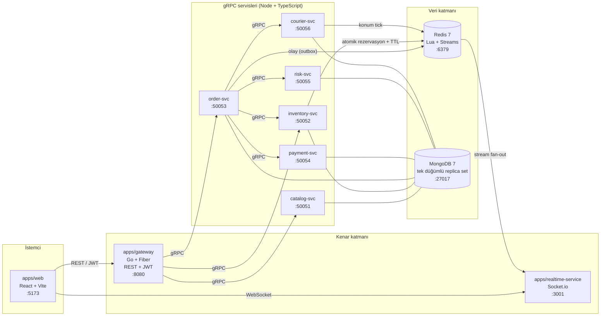
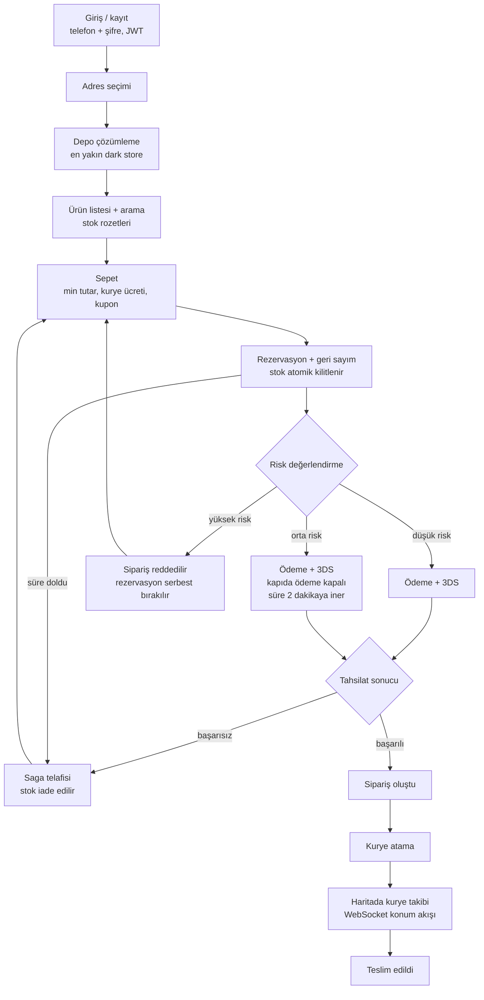

# quick-commerce-microservices

Quick-commerce (hızlı market) sipariş ve teslimat sisteminin uçtan uca çalışan dağıtık
simülasyonu: tek dış kapı olarak Go gateway, arkasında gRPC ile konuşan Node/TypeScript
mikroservisler, Redis üzerinde Lua ile atomik stok rezervasyonu ve TTL, outbox destekli saga
tabanlı sipariş akışı, deterministik kural motoruyla risk skorlama ve WebSocket üzerinden canlı
kurye takibi. Amaç bir vitrin uygulaması değil; eşzamanlılık, tutarlılık ve telafi
(compensation) problemlerinin gerçekten çözüldüğü bir sistem kurmak.

> Eğitim amaçlı kişisel projedir; Getir ile herhangi bir ilişkisi yoktur.

---

## Bu projenin kalbi

Geri kalan her şey bu üç davranışı taşıyan altyapıdır:

1. **Stok kilidi** — Aynı anda iki kişi son ürünü alamaz. Kontrol, düşüm, rezervasyon kaydı ve
   indeks yazımı tek bir Redis Lua script'i içinde tek atomik adımda yürür; "önce oku, sonra yaz"
   arası yoktur, bu yüzden yarış koşulunda ikinci istek deterministik olarak reddedilir ve stok
   asla eksiye düşmez.
2. **Rezervasyon TTL'i** — Sepetteki ürün rezerve edilir ama sonsuza kadar tutulmaz. Ödeme
   süresinde tamamlanmazsa rezervasyon düşer ve stok havuza geri döner
   (`RESERVATION_TTL_SECONDS=600`, risk motoru orta risk işaretlerse
   `RESERVATION_TTL_MEDIUM_RISK_SECONDS=120`). Süre bitimi kaybolabilen Redis expire olayına değil,
   `SWEEPER_INTERVAL_MS=1000` aralığıyla taranan bir ZSET indeksine bağlıdır.
3. **Canlı kurye takibi** — Sipariş verildikten sonra kurye gerçek zamanlı hareket eder; konum
   `COURIER_TICK_MS=2000` aralıklarla üretilir, WebSocket ile haritaya basılır ve tahmini varış
   süresi `COURIER_SPEED_KMH=20` üzerinden yeniden hesaplanır.

---

## Mimari genel bakış

Tek dış kapı Go gateway'dir; tarayıcı hiçbir gRPC servisine doğrudan erişemez. Gerçek zamanlı
trafik ayrı bir Socket.io servisinden akar, çünkü WebSocket yaşam döngüsü REST'ten tamamen farklı
ölçeklenir.



Ok yönü bağımlılık yönüdür: `order-svc` diğerlerini çağırır, kimse `order-svc`'yi senkron
çağırmaz — bu, döngüsel bağımlılığı baştan yasaklar.

| Servis                   | Dil                       | Sorumluluk                                              | Port  |
| ------------------------ | ------------------------- | ------------------------------------------------------- | ----- |
| `apps/web`               | TypeScript (React + Vite) | Mağaza arayüzü, sepet, geri sayım, canlı harita         | 5173  |
| `apps/gateway`           | Go (Fiber)                | REST→gRPC çeviri, JWT, rate limit, idempotency key      | 8080  |
| `apps/realtime-service`  | Node/TS                   | Socket.io odaları, event fan-out, yetki kontrolü        | 3001  |
| `apps/catalog-service`   | Node/TS                   | Ürün, kategori ve dark store katalogları                | 50051 |
| `apps/inventory-service` | Node/TS                   | Stok gerçeği, atomik rezervasyon, TTL serbest bırakma   | 50052 |
| `apps/order-service`     | Node/TS                   | Sipariş durum makinesi ve saga orkestrasyonu            | 50053 |
| `apps/payment-service`   | Node/TS                   | Mock kart ödemesi + 3DS simülasyonu                     | 50054 |
| `apps/risk-service`      | Node/TS                   | Kural motoru, skor üretimi, aksiyon bandı               | 50055 |
| `apps/courier-service`   | Node/TS                   | Kurye atama, sahte GPS üretimi, rota ilerletme          | 50056 |
| MongoDB                  | —                         | Kalıcı gerçek; çok belgeli transaction için replica set | 27017 |
| Redis                    | —                         | Stok sayacı, rezervasyon indeksi, olay omurgası         | 6379  |

Üç iletişim kanalı vardır ve her biri tek bir iş için kullanılır: **REST** (tarayıcı→gateway),
**gRPC** (servisler arası senkron komut/sorgu), **Redis Streams** (asenkron olay yayını). Bir akışı
ikisiyle birden yapmak yasaktır.

> Metrics portu sihirli sayı değildir, kural şudur: **servis portu + 1000**, `/metrics` yolundan
> HTTP ile sunulur (gateway 9080, realtime 4001, catalog 51051, ...). Mongo tek düğümlü replica set
> olduğu için bağlantı dizesi `mongodb://localhost:27017/getir?directConnection=true` şeklindedir —
> `replicaSet` parametresi ile `directConnection` aynı dizede **birlikte kullanılamaz**.

---

## Kullanıcı akış şeması



---

## Kurulum

### Gerekli araçlar

| Araç                              | Sürüm      | Kontrol komutu           | Ne zaman gerekli         |
| --------------------------------- | ---------- | ------------------------ | ------------------------ |
| Node                              | 22 LTS     | `node -v`                | Gün 1'den itibaren       |
| pnpm                              | 9+         | `pnpm -v`                | Gün 1'den itibaren       |
| Docker                            | Compose v2 | `docker compose version` | Gün 1'den itibaren       |
| buf                               | 1.73       | `buf --version`          | **Gün 2'den itibaren**   |
| Go                                | 1.25+      | `go version`             | Yalnızca Go çıktısı için |
| protoc-gen-go, protoc-gen-go-grpc | go.mod'dan | `go install` ile kurulur | Yalnızca Go çıktısı için |

Gün 1'i tamamlamak için Node, pnpm ve Docker yeterlidir.

**buf Gün 2'den itibaren ZORUNLUDUR.** Sebebi ilk bakışta görünmez: `packages/proto` paketinin
TypeScript kaynağı depoda yoktur, `.proto` dosyalarından üretilir. Bu yüzden `pnpm verify`,
`pnpm typecheck` ve `pnpm build` zincirlerinin hepsi `buf generate` çağırır — buf kurulu değilse
bu komutlar `buf: command not found` ile düşer.

**Go ise opsiyoneldir.** Yalnızca Go çıktısını (`apps/gateway`'in kullanacağı kod) üretmek ve
derlemek için gerekir. Node tarafında çalışan bir geliştirici Go kurmadan `pnpm verify`'ı yeşil
geçirebilir; kod üretiminin iki şablona ayrılmış olmasının sebebi tam olarak budur
(`buf.gen.ts.yaml` / `buf.gen.go.yaml`). Go yarısını CI'daki `codegen` işi her PR'da derler.
Go sürümü `packages/proto/go.mod` dosyasından gelir; `grpc v1.84` Go 1.25 istediği için taban
1.23 değil **1.25**'tir.

### Adımlar

**1) Depoyu klonla**

```bash
git clone <repo-url> quick-commerce-microservices
cd quick-commerce-microservices
```

**2) Ortam dosyasını oluştur**

Windows, `cmd.exe`:

```bat
copy .env.example .env
```

Windows, PowerShell:

```powershell
Copy-Item .env.example .env
```

Git Bash / Linux / macOS:

```bash
cp .env.example .env
```

Kökte tek bir `.env.example` durur; her servis kendi önekini okur (`ORDER_`, `INVENTORY_`, ...).
Değerler Zod şemasına göre doğrulanır: eksik değişkende process **başlangıçta ölür**, yarım
yapılandırmayla çalışan servis olmaz. Yerel geliştirme için varsayılanlar hazırdır, ilk kurulumda
düzenleme gerekmez.

| Değişken                              | Varsayılan                                              | Anlamı                                                                               |
| ------------------------------------- | ------------------------------------------------------- | ------------------------------------------------------------------------------------ |
| `MONGO_URI`                           | `mongodb://localhost:27017/getir?directConnection=true` | Tek düğümlü replica set bağlantısı                                                   |
| `REDIS_URL`                           | `redis://localhost:6379`                                | Stok sayacı, rezervasyon indeksi, olay omurgası                                      |
| `MOCK`                                | `true`                                                  | Dış dünyaya çıkılmaz: ödeme, SMS ve harita deterministik sahte uygulamalarla değişir |
| `RESERVATION_TTL_SECONDS`             | `600`                                                   | Normal rezervasyon ömrü                                                              |
| `RESERVATION_TTL_MEDIUM_RISK_SECONDS` | `120`                                                   | Orta riskli siparişte kısaltılmış ömür                                               |
| `SWEEPER_INTERVAL_MS`                 | `1000`                                                  | Süresi dolan rezervasyonların tarama aralığı                                         |
| `COURIER_TICK_MS`                     | `2000`                                                  | Kurye konum güncelleme aralığı                                                       |
| `COURIER_SPEED_KMH`                   | `20`                                                    | Rota simülasyonu hızı, ETA hesabının girdisi                                         |
| `JWT_TTL`                             | `3600`                                                  | Erişim jetonu ömrü (saniye)                                                          |

Tam ve açıklamalı liste `.env.example` içindedir; yukarıdaki tablo yalnızca sistemin davranışını
doğrudan değiştiren kritik değerleri gösterir.

**3) pnpm'i hazırla**

```bash
corepack enable
```

`corepack enable` Windows'ta yönetici hakkı isteyebilir ya da `EPERM` verebilir. O durumda
alternatif:

```bash
npm i -g pnpm@9
```

Doğrula:

```bash
pnpm -v
```

**4) Bağımlılıkları kur**

```bash
pnpm install
```

**5) Altyapıyı ayağa kaldır**

```bash
pnpm infra:up   # docker compose -f infra/docker/docker-compose.dev.yml up -d
```

Bu komut yalnızca durum tutan iki servisi başlatır: MongoDB ve Redis. Uygulama servisleri bilerek
konteynerize edilmemiştir; host üzerinde `pnpm dev` ile çalışırlar (hızlı yeniden yükleme ve kolay
hata ayıklama için).

**6) Sağlığı doğrula**

```bash
pnpm infra:ps   # docker compose -f infra/docker/docker-compose.dev.yml ps
```

`mongo` ve `redis` servisleri `STATUS` sütununda **healthy** görünmelidir. Mongo'nun healthy
duruma geçmesi ilk açılışta birkaç saniye sürer: replica set (`rs0`) ayrı bir init konteyneri veya
elle `mongosh` adımı olmadan, healthcheck içindeki `rs.initiate` ile kendi kendine başlar.
Konteyner healthy olduğunda replica set de hazırdır, yani transaction'lar çalışır.

**7) Kurulumu doğrula**

```bash
pnpm verify
```

`pnpm verify`, CI ile aynı zinciri koşar: `lint` → `lint:style` → `lint:proto` → `format:check` → `typecheck` → `build` → `test:unit`. (Script adı bilerek `ci` değil: `pnpm ci`, pnpm'in kendi komutudur ve
package.json script'ini çalıştırmaz.) Bu komut Gün 1
itibarıyla geçmelidir; geçmiyorsa kurulum tamamlanmamıştır, devam etme.

### Henüz gerekmeyen adımlar

Bu adımlar yol haritasında vardır ama bugün çalıştırmanın bir etkisi yoktur; ilgili gün geldiğinde
devreye girerler:

```bash
cd apps/gateway && go mod tidy   # apps/gateway Gün 3'te geliyor
pnpm seed                        # Gün 4'te Mongo'ya başlangıç verisini yükler
```

---

## Komutlar

Hepsi depo kökünden `pnpm <komut>` ile çalışır. `make` bu projede zorunlu değildir; Windows'ta
`make` kurulu olmadığı için Makefile hedeflerinin karşılığı pnpm script'i olarak tanımlanmıştır.

| Komut          | Arkasındaki iş                                                                                        | Ne yapar                                                           | Durum                                   |
| -------------- | ----------------------------------------------------------------------------------------------------- | ------------------------------------------------------------------ | --------------------------------------- |
| `dev`          | `turbo run dev`                                                                                       | Tüm uygulamaları izleme modunda paralel başlatır                   | Çalışıyor (T3.1: catalog; önce `build`) |
| `build`        | `turbo run build`                                                                                     | Tüm paketleri derler                                               | Çalışıyor                               |
| `typecheck`    | `turbo run typecheck`                                                                                 | Çıktı üretmeden tip denetimi                                       | Çalışıyor                               |
| `lint`         | `eslint .`                                                                                            | ESLint 9 flat config ile tüm depo                                  | Çalışıyor                               |
| `lint:fix`     | `eslint . --fix`                                                                                      | Otomatik düzeltilebilen lint hatalarını giderir                    | Çalışıyor                               |
| `lint:style`   | `stylelint "apps/web/**/*.css"`                                                                       | CSS denetimi; `--allow-empty-input` ile dosya yokken de yeşil      | Çalışıyor                               |
| `lint:proto`   | `buf lint` + `buf format --diff --exit-code`                                                          | gRPC sözleşmesinin kural ve biçim kapısı (`buf` kurulu olmalı)     | Çalışıyor                               |
| `format`       | `prettier --write .`                                                                                  | Tüm depoyu biçimlendirir                                           | Çalışıyor                               |
| `format:check` | `prettier --check .`                                                                                  | Biçim farkı varsa hata verir                                       | Çalışıyor                               |
| `test`         | `pnpm run test:unit`                                                                                  | Birim testleri (tek koşucu: kökteki vitest yapılandırması)         | Çalışıyor                               |
| `test:unit`    | `vitest run`                                                                                          | Birim testleri; altyapı gerektirmez                                | Çalışıyor (`--passWithNoTests`)         |
| `test:int`     | `vitest run --config vitest.integration.config.ts`                                                    | Testcontainers ile Mongo/Redis entegrasyon testleri                | Çalışıyor (T2.5)                        |
| `race`         | `node -e "..."`                                                                                       | Yarış koşulu senaryosu: aynı stok için eş zamanlı rezervasyon      | **Placeholder — Gün 11 (T11.1)**        |
| `demo`         | `node -e "..."`                                                                                       | Uçtan uca demo: sipariş → ödeme → kurye akışı                      | **Placeholder — Gün 15 (T15.1)**        |
| `seed`         | `node -e "..."`                                                                                       | Mongo'ya market / ürün / stok başlangıç verisi                     | **Placeholder — Gün 4**                 |
| `proto:gen`    | `pnpm --filter @getir/proto generate`                                                                 | `.proto` dosyalarından **TS ve Go** kodu üretir (Go kurulu olmalı) | Çalışıyor (T2.3)                        |
| `proto:gen:ts` | `pnpm --filter @getir/proto generate:ts`                                                              | Yalnızca TypeScript çıktısı; Go gerektirmez                        | Çalışıyor (T2.3)                        |
| `proto:check`  | `generate:ts && typecheck && check:go`                                                                | Üretilen kodun **iki dilde de** derlendiğini doğrular              | Çalışıyor (T2.3)                        |
| `verify`       | `proto:gen:ts && lint && lint:style && lint:proto && format:check && typecheck && build && test:unit` | CI'daki `quality` işinin birebir aynısı                            | Çalışıyor                               |
| `infra:up`     | `docker compose -f infra/docker/… up -d`                                                              | Mongo (replica set) + Redis'i başlatır                             | Çalışıyor                               |
| `infra:ps`     | `docker compose … ps`                                                                                 | Konteyner ve sağlık durumu                                         | Çalışıyor                               |
| `infra:logs`   | `docker compose … logs -f`                                                                            | Altyapı günlüklerini izler                                         | Çalışıyor                               |
| `infra:down`   | `docker compose … down`                                                                               | Konteynerleri durdurur (veri kalır)                                | Çalışıyor                               |
| `infra:reset`  | `docker compose … down -v`                                                                            | Konteyner **ve** veriyi siler, sıfırdan kurar                      | Çalışıyor                               |
| `clean`        | `turbo run clean`                                                                                     | Derleme çıktılarını ve önbellekleri siler                          | Çalışıyor                               |

### İlk servisi çalıştırma (T3.1)

```bash
pnpm --filter @getir/catalog-service build
pnpm --filter @getir/catalog-service start    # 50051 portunda gRPC

grpcurl -plaintext -import-path packages/proto/proto -proto getir/catalog/v1/catalog.proto \
  localhost:50051 getir.catalog.v1.CatalogService/ListCategories
```

Katalog verisi bugün bellekten gelir (sahte veri); Mongo bağımlılığı T4.1'de eklenecek, bu
yüzden servis `pnpm infra:up` olmadan da ayağa kalkar. Ayrıntı ve Docker imajı:
[`apps/catalog-service/README.md`](apps/catalog-service/README.md).

### Entegrasyon testleri ve Docker

`pnpm test:int` Mongo ve Redis'i **kendi ayağa kaldırır** (Testcontainers); `pnpm infra:up`
ile açtığınız geliştirme konteynerlerine dokunmaz, onların verisini kirletmez. Tek şart
çalışan bir Docker daemon'ı:

| Ortam                      | Ne gerekiyor                                                         |
| -------------------------- | -------------------------------------------------------------------- |
| CI (ubuntu runner)         | Hazır gelir, ek adım yok                                             |
| Docker Desktop (Win/macOS) | Açık olması yeterli                                                  |
| colima (macOS)             | `colima start` — soket otomatik bulunur, elle `DOCKER_HOST` gerekmez |

colima kurulumunda soket `~/.colima/default/docker.sock` altındadır ve Testcontainers onu
kendiliğinden bulamaz; ayrıca temizlik konteyneri (Ryuk) soketi **konteyner içindeki**
yoluyla ister. İkisi de `vitest.integration.config.ts` içinde tek yerde çözülür
(`DOCKER_HOST` + `TESTCONTAINERS_DOCKER_SOCKET_OVERRIDE`), `/var/run/docker.sock` varsa
hiçbir şey yapılmaz.

Testler bittiğinde konteynerler otomatik silinir.

### Kalite kapısı nerede?

Bu depoda **git pre-commit kancası yoktur** ve bu bilinçli bir karardır. Windows'ta
`C:\Windows\System32ash.exe` (WSL köprüsü) PATH'te Git'in kendi kabuğundan önce
gelebiliyor; WSL'de tam bir dağıtım kurulu değilse git kancası
`execvpe(/bin/bash) failed: No such file or directory` ile **commit'i tamamen bloke
ediyor** — üstelik hata, değiştirdiğiniz kodla hiç ilgili olmuyor. Çalışmayan ama
commit'i engelleyen bir kapı, olmayan kapıdan kötüdür.

Yerine iki gerçek kapı var:

| Ne zaman                    | Komut                                    | Kim zorlar     |
| --------------------------- | ---------------------------------------- | -------------- |
| Commit'ten önce (elle)      | `pnpm verify`                            | Geliştirici    |
| Her push ve pull request'te | `.github/workflows/ci.yml` → quality işi | GitHub Actions |

`pnpm verify`, CI'daki `quality` işiyle **birebir aynı** zinciri koşar; yerelde yeşilse
CI'da da yeşildir. Biçimlendirme için `pnpm format` yeterlidir.

**Placeholder script'ler hakkında dürüst not:** `race`, `demo` ve `seed` bugün
gerçek iş yapmaz (`proto:gen` T2.3'te gerçek üretime bağlandı). Her biri hangi günde ne yapacağını anlatan tek satırlık bir TODO mesajı basar ve
**sıfır çıkış koduyla** biter; böylece `pnpm verify` var olmayan bir özellik yüzünden kırmızıya
düşmez. Bunları boş şablon değil, tarihi belli ve sahibi belli birer TODO olarak okuyun —
tablodaki gün numarası hangi görevde dolacaklarını söyler.

Script'ler `cmd.exe` altında da çalışacak şekilde yazılmıştır: POSIX'e özgü `rm`, `cp`, `touch`
veya tek tırnaklı satır içi JSON kullanılmaz; gereken yerde `node -e` ile platformdan bağımsız
çözülür.

---

## Klasör haritası

Tek repo, üç üst klasör: `apps/` çalışan process'ler, `packages/` paylaşılan kod, `infra/`
çalıştırma ortamı. Bir klasörün yeri sorumluluğunu belirler; istisna yoktur.

```text
quick-commerce-microservices/
├── apps/                      # Çalışan process'ler (Gün 3'ten itibaren doluyor)
│   ├── gateway/               # Go - tek dış kapı
│   ├── catalog-service/       # Node - ürün, kategori, dark store  ← ilk servis (T3.1)
│   ├── inventory-service/     # Node - stok, rezervasyon, süpürücü
│   ├── order-service/         # Node - durum makinesi, saga, outbox
│   ├── payment-service/       # Node - mock kart + 3DS
│   ├── risk-service/          # Node - kural motoru
│   ├── courier-service/       # Node - atama + GPS simülatörü
│   ├── realtime-service/      # Node - Socket.io fan-out
│   └── web/                   # React + Vite arayüz
├── packages/                  # Paylaşılan kod; hiçbiri apps/* tanımaz
│   ├── core/                  # @getir/core - Result, AppError, ID üretimi, config loader
│   ├── contracts/             # @getir/contracts - Zod şemaları, ApiResponse zarfı
│   ├── proto/                 # @getir/proto - .proto + buf + üretilen TS/Go kodu
│   ├── pricing/               # @getir/pricing - min sepet, kurye ücreti, kupon
│   ├── redis-kit/             # @getir/redis-kit - client, key builder, Lua yükleyici
│   ├── mongo-kit/             # @getir/mongo-kit - client, repository tabanı, migration
│   ├── event-bus/             # @getir/event-bus - EventBus arayüzü + Redis Streams
│   ├── observability/         # @getir/observability - logger, request-id, metrics
│   ├── service-kit/           # @getir/service-kit - gRPC bootstrap, health, shutdown
│   └── testing/               # @getir/testing - fixture'lar, testcontainers yardımcıları
├── infra/                     # Çalıştırma ortamı
│   ├── docker/                # docker-compose.dev.yml, redis.conf (+ kendi README'si)
│   ├── seed/                  # seed verisi ve MOCK modu fixture'ları        [Gün 4]
│   └── scripts/               # geliştirme ve kod üretimi betikleri          [Gün 2]
├── docs/
│   ├── adr/                   # Numaralı mimari karar kayıtları (14 adet + dizin)
│   ├── api/                   # openapi.yaml, socket-events.md, Postman     [Gün 2]
│   └── roadmap.md             # 20 günlük yol haritası ve görev panosu
├── .github/workflows/ci.yml   # CI kapıları
├── .env.example               # Tüm ortam değişkenlerinin belgelenmiş örneği
├── package.json               # Kök script'ler
├── pnpm-workspace.yaml        # Workspace tanımı (apps/*, packages/*)
└── turbo.json                 # Görev grafiği ve önbellek
```

Köşeli parantezli notlar o klasörün hangi günde geleceğini söyler. Bugün depoda gerçekten bulunan
kısım şudur: kök yapılandırması, `infra/docker/`, `packages/core/`, `docs/adr/` ve `docs/roadmap.md`.
Kalanı hedef yapıdır ve yol haritasındaki sırayla doldurulur.

Üç kural klasör karışıklığını önler:

- `apps/*` birbirini import edemez; ortak kod `packages/*` altına taşınır.
- `packages/*` hiçbir `apps/*`'i tanımaz; bağımlılık her zaman aşağı doğrudur.
- Bir dosyayı nereye koyacağın belirsizse, o dosya muhtemelen bir use-case'tir ve ilgili servisin
  `application/` klasörüne girer.

---

## Geliştirme kuralları

Bunlar üslup tercihi değil, inceleme ve lint sırasında uygulanan değişmez kurallardır:

1. **Doğrulanmamış veri `application/` katmanına giremez.** Dışarıdan gelen her şey (REST gövdesi,
   gRPC mesajı, ortam değişkeni, olay yükü) sınırda `@getir/contracts` içindeki Zod şemasından
   geçer; tipler `z.infer` ile şemadan türer, elle `as` ile zorlanmaz.
2. **`domain/` dışarı bakmaz.** `domain/` içinde `mongodb`, `ioredis` veya `grpc` import'u olamaz;
   bağımlılık oku hiçbir zaman yukarı gitmez, `infrastructure/` katmanı `application/`'ı çağıramaz.
3. **`process.env` yalnızca `config/` içinde okunur.** Başka hiçbir dosya doğrudan ortam
   değişkenine dokunmaz; kod, doğrulanmış ve tipli config nesnesini parametre olarak alır.
4. **`console.log` yasak.** Günlükleme yapılandırılmıştır:
   `logger.info({ orderId }, "mesaj")` biçiminde, korelasyon kimliğiyle.
5. **Bileşende ham renk veya ölçü yok.** Görsel değerler design token'larda, iş sabitleri
   `config/constants.ts` içinde durur; böylece tema ya da eşik değişimi tek dosyayı etkiler.
6. **Para birimi kuruştur.** Tüm tutarlar minor unit tam sayısıdır; float ile para hesabı
   yapılmaz, biçimlendirme yalnızca görüntüleme katmanında olur.

Ek kurallar: sihirli sayı yasaktır, eşikler ve süreler isimlendirilmiş sabit olarak durur. Her
hata tek tiptir (`AppError`: kod, mesaj, detay) ve gRPC status'a tek yerde çevrilir. gRPC handler
ince olur: doğrula, use-case'i çağır, cevabı çevir. Kod tanımlayıcıları İngilizce'dir; açıklama ve
yorumlar Türkçe olabilir.

TypeScript strict ve ESM (`module`/`moduleResolution: "NodeNext"`) zorunludur. NodeNext kuralı
gereği göreli import'lar **`.js` uzantısıyla** yazılır:

```ts
import { ok, err } from './result.js';
```

---

## Yol haritası

| Faz   | Kapsam                                                                      | Gün   | Durum            |
| ----- | --------------------------------------------------------------------------- | ----- | ---------------- |
| Faz 1 | Sözleşmeler ve iskelet: monorepo, Docker, `packages/core`, proto taslakları | 1–3   | **Devam ediyor** |
| Faz 2 | İş servisleri ve çekirdek risk: catalog, order, payment, risk               | 4–7   | Bekliyor         |
| Faz 3 | Gateway ve stok motoru: Go gateway, atomik kilit, TTL, süpürücü             | 8–11  | Bekliyor         |
| Faz 4 | Gerçek zamanlı katman: kurye simülatörü, Socket.io, canlı harita            | 12–15 | Bekliyor         |
| Faz 5 | Tasarım, cila ve teslim                                                     | 16–20 | Bekliyor         |

Kapsam iki halkadan oluşur: **Opsiyon A** (Gün 8'de kapanan zorunlu taban) ve **Opsiyon B**
(Gün 20'de teslim edilen taahhüt). Gerçek ödeme entegrasyonu, gerçek harita rotalama servisi,
çoklu dil, mobil uygulama ve Kubernetes bilinçli olarak kapsam dışıdır.

**Şu anki durum — Gün 1 devam ediyor.** T1.1–T1.5 tamamlandı; sırada **T1.6** var.

| Görev | İçerik                                                                                 | Durum     |
| ----- | -------------------------------------------------------------------------------------- | --------- |
| T1.1  | Monorepo iskeleti: pnpm workspace, turbo, tsconfig tabanı, eslint, prettier, stylelint | ✅        |
| T1.2  | `docker-compose.dev.yml` + altyapı yapılandırması                                      | ✅        |
| T1.3  | `packages/core`: Result, AppError, ID üretici, hata kodları, Zod env loader            | ✅        |
| T1.4  | Kurulum dosyaları: README, `.env.example`, `.editorconfig`, `.nvmrc`                   | ✅        |
| T1.5  | `docs/adr/` karar kayıtları + `docs/api/` iskeleti                                     | ✅        |
| T1.6  | `common.proto` + `catalog.proto` taslağı, buf yapılandırması                           | ⏭️ sırada |

Gün 1 sonunda `docker compose up -d` ile Mongo ve Redis ayağa kalkmış, `buf lint` temiz geçmiş
olur. Ayrıntılı görev panosu: [`docs/roadmap.md`](docs/roadmap.md).

---

## Mimari karar kayıtları (ADR)

Sistemin neden böyle kurulduğunu anlatan kararlar `docs/adr/` altında, her biri tek sayfalık
dosyada durur:

| No                                                        | Karar                                                                        | Neden                                                                                                 |
| --------------------------------------------------------- | ---------------------------------------------------------------------------- | ----------------------------------------------------------------------------------------------------- |
| [ADR-01](docs/adr/0001-lua-vs-redlock.md)                 | Sıcak yoldaki stok düşümü Redlock ile değil, tek Lua script'i ile yapılır    | Redis tek thread'lidir, Lua zaten atomiktir; Redlock ağ gecikmesi ve saat kayması riski ekler.        |
| [ADR-02](docs/adr/0002-rezervasyon-suresi-zset.md)        | Rezervasyon süresi bitimi keyspace notification'a güvenmez                   | Redis expire olayları kaybolabilir; gerçek kaynak `resv:index` ZSET'idir, süpürücü 1 sn'de bir tarar. |
| [ADR-03](docs/adr/0003-stok-gercegi-mongo-sayac-redis.md) | Stok gerçeği Mongo'da, hızlı sayaç Redis'te durur                            | Redis düşerse mali kayıt kaybolmaz; açılışta sayaç `stock` koleksiyonundan seed edilir.               |
| [ADR-04](docs/adr/0004-outbox-ile-olay-yayini.md)         | Servisler arası olaylar outbox üzerinden yayınlanır                          | "Mongo'ya yazıldı ama olay gitmedi" durumunu imkânsız kılar; ikili yazım ortadan kalkar.              |
| [ADR-05](docs/adr/0005-koleksiyon-sahipligi.md)           | Her servis kendi koleksiyonlarının tek sahibidir                             | Başka servisin koleksiyonuna yazmak da okumak da reddedilir; erişim yalnızca gRPC ile olur.           |
| [ADR-06](docs/adr/0006-realtime-ayri-process.md)          | Realtime, gateway'den ayrı bir process'tir                                   | Go'da Socket.io protokol uyumu zahmetli; WebSocket bağlantıları farklı ölçeklenir.                    |
| [ADR-07](docs/adr/0007-eventbus-arayuzu.md)               | Olay hattı `EventBus` arayüzü arkasında durur                                | Kafka'ya geçiş tek dosyalık bir uygulama değişikliği olur, çağıran kod değişmez.                      |
| [ADR-08](docs/adr/0008-idempotency-key.md)                | Tüm mutasyon uçları `Idempotency-Key` ister                                  | Anahtar önce `NX` ile in-progress yazılır; çift tıklama veya otomatik retry ikinci siparişi yaratmaz. |
| [ADR-09](docs/adr/0009-api-first.md)                      | Sözleşme koddan önce yazılır, `MOCK=1` modu zorunludur                       | Frontend ve backend paralel ilerler; UI değişen sözleşme yüzünden iki kez yazılmaz.                   |
| [ADR-10](docs/adr/0010-zod-tek-dogrulama.md)              | Çalışma zamanı doğrulaması tek kütüphaneyle, Zod ile yapılır                 | Şema ve TypeScript tipi tek kaynaktan (`z.infer`) türer, çift bakım ortadan kalkar.                   |
| [ADR-11](docs/adr/0011-token-ve-sabitler.md)              | Görsel değerler design token'da, iş sabitleri `config/constants.ts`'te durur | Tema veya eşik değişimi tek dosyayı etkiler; sihirli sayı ve ondalıklı para yasaktır.                 |
| [ADR-12](docs/adr/0012-kimlik-telefon-sifre.md)           | Kimlik doğrulama telefon + şifre ile yapılır, SMS/OTP kurulmaz               | bcrypt hash, JWT + refresh token; `otp-velocity` kuralı ileriye bırakılır.                            |
| [ADR-13](docs/adr/0013-sepet-sadece-tarayicida.md)        | Sepet durumu sunucuda tutulmaz, tarayıcıda yaşar                             | Zustand + localStorage; sepetin sunucudaki karşılığı rezervasyondur, `carts` koleksiyonu yoktur.      |
| [ADR-14](docs/adr/0014-frontend-paralel-gelistirme.md)    | Frontend Gün 4'te başlar ve backend ile paralel ilerler                      | `MOCK=1` sayesinde servis beklenmez; Gün 16-20 yalnızca tasarım ve cilaya kalır.                      |

Her kararın bağlam, gerekçe ve sonuç bölümleri için kayıtların kendisine bakın; klasörün kendi
dizini [`docs/adr/README.md`](docs/adr/README.md) içindedir. Kayıtlar değiştirilmez: bir karar
geçersiz kaldığında mevcut dosyanın durumu güncellenir ve yerini alan yeni bir ADR yazılır.

---

## Demo senaryosu (8 dakika)

`pnpm demo` bu sırayı otomatik koşturacak şekilde yazılacaktır (Gün 7):

1. **0:00 — Kayıt ve konum.** Kayıt olunur, konum seçilir; en yakın dark store belirlenir.
2. **1:00 — Ürün listesi ve sepet.** Stok rozetleri görünür durumdayken sepete 3 ürün eklenir.
3. **2:00 — Rezervasyon ve geri sayım.** Ödeme ekranı açılır, geri sayım başlar; ikinci tarayıcıda
   aynı ürünün stoğunun azaldığı gösterilir.
4. **3:00 — Sürenin dolması.** Beklenir ve süre dolar; stok geri gelir. **Bu sahne projenin
   vitrinidir.**
5. **4:00 — Risk bandı.** Yeni hesapla aynı sipariş denenir: orta risk bandına düşer, kapıda ödeme
   kapanır ve süre 2 dakikaya iner.
6. **5:00 — Ödeme.** Kart ile ödenir, 3DS kodu girilir, sipariş oluşur.
7. **6:00 — Teslimat.** Kurye atanır, harita üzerinde pürüzsüz hareket izlenir, teslimat kapanır.
8. **7:00 — Yarış koşulu kanıtı.** `pnpm race` koşturulur: 100 eş zamanlı istek gider, tam olarak
   1 sipariş başarılı olur.

---

## Lisans ve sorumluluk reddi

Bu depo eğitim ve portföy amacıyla yazılmış kişisel bir çalışmadır. Getir ya da başka bir şirketle
hiçbir ilişkisi, onayı veya bağlantısı yoktur; marka adı, logo ve özel veri kullanılmaz. Ödeme,
3DS, adres, harita ve kurye hareketleri tamamen simülasyondur — gerçek bir ödeme sağlayıcısına
veya harita rotalama servisine bağlanmaz ve üretim ortamında kullanılmak üzere tasarlanmamıştır.
Kod MIT lisansı altında sunulur; ayrıntı için `LICENSE` dosyasına bakın.
