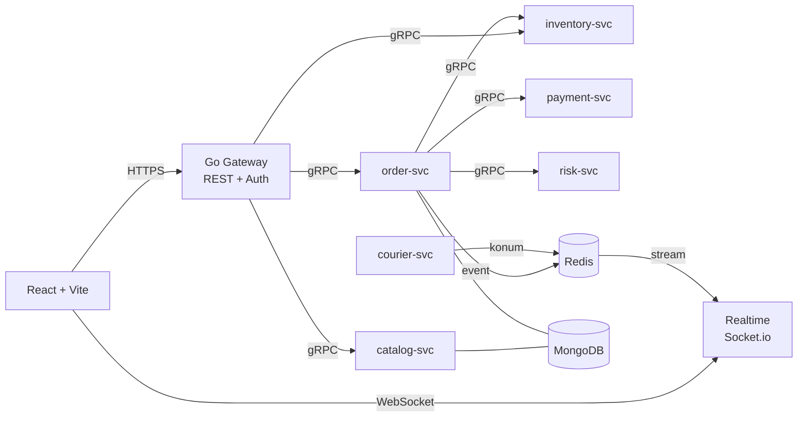
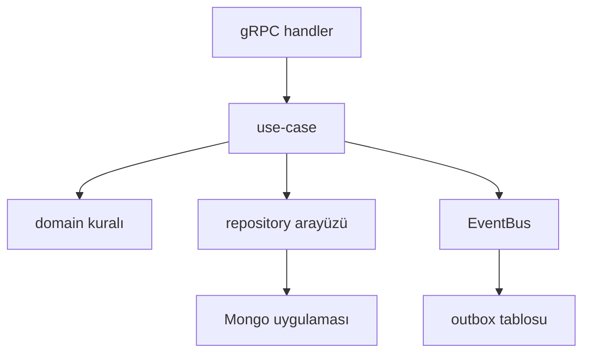
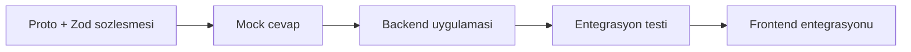
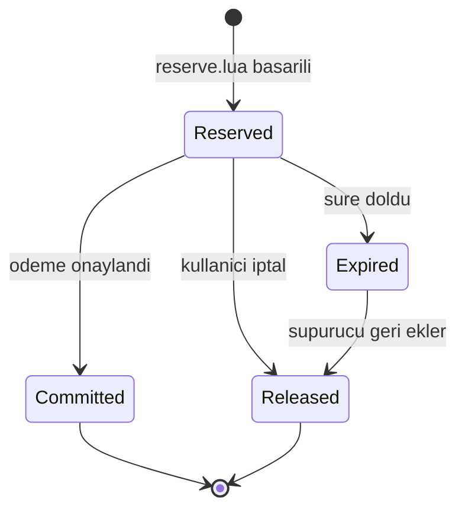
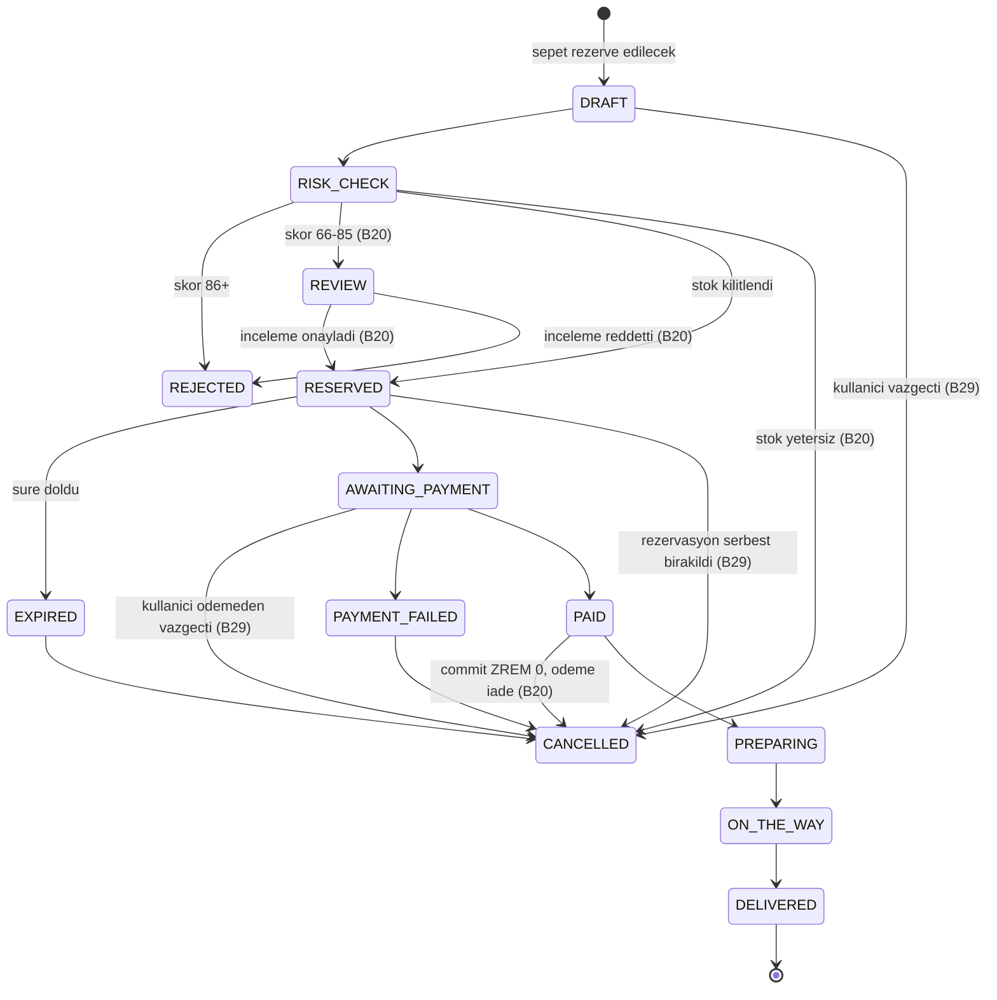
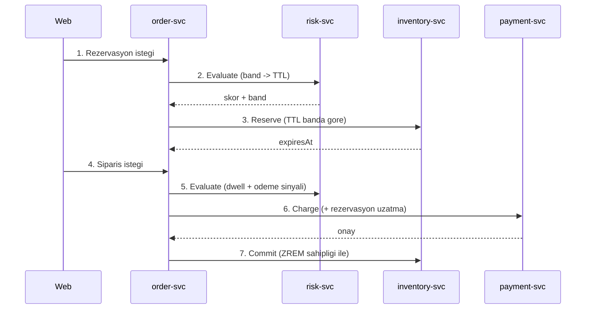

<!-- Ilk surum masaustundeki Word roadmap'inden uretildi. T4.1'den beri TEK KAYNAK bu
     dosyadir ve elle guncellenir (Word/PDF belge ilk surumdur, guncel degildir).
     Degisiklikler PR ile yapilir; mimari kararlar docs/adr/ altina yazilir. -->

# Getir Market Klonu — Mimari & 20 Günlük Roadmap (Opsiyon A + B)

Kaynak: mimari & 20 günlük yol haritası belgesi · Son güncelleme: 2026-09-23 (pazaryeri modeli, ADR-15)

## Yönetici Özeti

Quick-commerce (GetirMarket tipi) bir **pazaryerinin** çalışan dağıtık simülasyonunu kuruyoruz — kullanıcı konumuna hizmet veren marketleri (Migros Jet, A101, Kardeşler Manavı…) görür, birini seçer ve o marketin ürünlerini o marketin fiyat ve kurallarıyla sipariş eder (ADR-15): Opsiyon A 11. günde kapanan zorunlu taban (B19), Opsiyon B 20. günde teslim edilen taahhüt. Bu doküman kod yazılmadan önce tüm sözleşmeleri, klasör yapısını ve gün gün atomik görevleri sabitler.

Sistemin kalbi üç şey: stok kilidi (aynı anda iki kişi son ürünü alamaz), rezervasyon TTL'i (ödeme yapılmazsa stok geri döner) ve canlı kurye takibi (WebSocket + interpolasyon). Geri kalan her şey bu üçünü taşıyan altyapıdır.

| Kapsam    | Ne içerir                                                                                                             | Bitiş  | Durum                                |
| --------- | --------------------------------------------------------------------------------------------------------------------- | ------ | ------------------------------------ |
| Opsiyon A | Go Gateway, gRPC servis iskeleti, ürün/kategori, basit stok + 10 dk TTL, çekirdek risk kuralları (kimlik dahil)       | Gün 11 | Zorunlu taban                        |
| Opsiyon B | A + sepet, kart ödeme simülasyonu, Redis atomik kilit, sahte GPS + buffer, Leaflet canlı kurye, risk aksiyon bantları | Gün 20 | Taahhüt                              |
| Opsiyon C | Genişletilmiş fraud kuralları, Risk DevTools, Shadow Capture                                                          | —      | Stretch (mimari hazır, kod sonra)    |
| Opsiyon D | Prometheus/Grafana, Kafka/RabbitMQ                                                                                    | —      | Bonus (port/adapter ile takılabilir) |

Kapsam dışı (bilinçli): gerçek ödeme entegrasyonu, gerçek harita rotalama servisi (OSRM yerine sabit polyline), çoklu dil, mobil uygulama, Kubernetes.

Tasarım sorumluluğu: Frontend'in görsel tasarımı ve bileşen stilleri sende. Bu roadmap frontend için sadece veri katmanını (tip üretimi, API istemcisi, socket hook'ları, state) tanımlar; senin tasarladığın bileşenler bu katmana takılır. Frontend, sözleşmeler donduktan sonra Gün 4'te MOCK=1 modu üzerinden başlar ve backend ile paralel ilerler; Gün 16-20 yalnızca tasarım, cila ve teslime ayrılır.

## İş Modeli: Pazaryeri (ADR-15)

İlk sürüm Getir'in kendi depolarını (dark store) kurguluyordu: sistem en yakın depoyu atar, tek katalog ve tek fiyat vardır. Ürünün ekran tasarımı ise bir **pazaryeri** gösteriyor: "Yakındaki Marketler" listesi, her marketin puanı, mesafesi, teslimat süresi, minimum tutarı ve kendi fiyatları. Model ADR-15 ile pazaryerine çevrildi. Bu bölüm dokümanın geri kalanını yorumlarken bağlayıcıdır: eski metinde "depo" ya da "dark store" geçen yerler **market** olarak okunur.

| Kavram         | Pazaryerindeki anlamı                                                                                                                                                                                           |
| -------------- | --------------------------------------------------------------------------------------------------------------------------------------------------------------------------------------------------------------- |
| Market         | Bağımsız satıcı (eski adı dark store): marka, logo, konum, teslimat yarıçapı, açık/kapalı, teslimat süresi aralığı, puan ve **kendi fiyat kuralları** (minimum sepet, teslimat ücreti, ücretsiz teslimat eşiği) |
| Ürün           | Ortak katalog kaydı: sku, ad, birim, görsel, kategori. **Fiyat taşımaz**                                                                                                                                        |
| Teklif (offer) | Bir marketin bir ürünü satışı: `(marketId, productId) → priceMinor, isActive`. Aynı süt Migros'ta ve A101'de farklı fiyattadır                                                                                  |
| Kategori       | Platformun ortak sınıflandırması; market yalnızca teklifi olan kategorileri gösterir                                                                                                                            |
| Stok           | Market + sku kapsamlıdır (inventory)                                                                                                                                                                            |
| Sepet          | **Tek markettir**; market değiştirmek dolu sepeti boşaltmayı gerektirir (istemci onay ister)                                                                                                                    |
| Kupon          | Platformundur (ILK10, KARGOBEDAVA): tüm marketlerde geçerli                                                                                                                                                     |
| Market paneli  | **Kapsam dışı.** Marketlerin ürün, fiyat ve kural girdiği yönetim ekranı yok; seed onun yerini tutar. Puanlar seed'de sabittir, yorum sistemi yok                                                               |

**Akış:** adres seçilir → konuma hizmet veren marketler listelenir (yakından uzağa; boşsa "bölgende market yok") → kullanıcı marketi seçer → market sayfası (puan, süre, min. tutar, kategoriler) → ürünler o marketin fiyatı ve stoğuyla → sepet o marketin kurallarıyla hesaplanır → rezervasyon, risk, ödeme ve kurye akışı aynen devam eder (kurye marketten alır).

**Kimlik biçimi** (T8.4'ten önce açık kalan karar burada kapandı): katalog kimlikleri önekli ve okunabilirdir (`mkt_migros-jet-moda`, `prd_sut-1l`, `cat_sut-kahvaltilik`, `ofr_…`); sözleşme bunları UUID olarak değil bu biçimle doğrular. Çalışma anında üretilen kimlikler (sipariş, ödeme, kullanıcı) @getir/core'un önek + 32 hex üreticisinden gelir.

**Mevcut kodun karşılığı:** T4.2'nin `listDarkStoresByDistance` sorgusu "yakındaki marketler"in kendisidir; T4.1'in `products.darkStoreIds` alanı teklif koleksiyonuna dönüşür; `ResolveDarkStore`'un kapalı/yarıçap kuralı market listesinde "Kapalı" rozeti ve rezervasyondaki NO_STORE olarak yaşar. Dönüşüm T4.7 (sözleşme) ve T4.8 (catalog) ile yapılır.

## Mimari Genel Bakış

Tek dış kapı Go Gateway'dir; tarayıcı hiçbir gRPC servisine doğrudan erişemez. Gerçek zamanlı trafik ayrı bir Socket.io servisinden akar, çünkü WebSocket yaşam döngüsü REST'ten tamamen farklı ölçeklenir.



Ok yönü bağımlılık yönüdür: order-svc diğerlerini çağırır, kimse order-svc'yi senkron çağırmaz — bu döngüsel bağımlılığı başından yasaklar.

| Servis        | Dil        | Tek cümlelik sorumluluğu                              | Yazdığı veri                                 |
| ------------- | ---------- | ----------------------------------------------------- | -------------------------------------------- |
| gateway       | Go (Fiber) | REST→gRPC çeviri, JWT, rate limit, idempotency key    | yok (sadece Redis rate-limit)                |
| catalog-svc   | Node/TS    | Market, ürün, teklif (fiyat) ve kategori katalogları  | Mongo: markets, products, offers, categories |
| inventory-svc | Node/TS    | Stok gerçeği, atomik rezervasyon, TTL serbest bırakma | Mongo: stock; Redis: stock:_, resv:_         |
| order-svc     | Node/TS    | Sipariş durum makinesi ve saga orkestrasyonu          | Mongo: orders, outbox                        |
| payment-svc   | Node/TS    | Mock kart ödemesi + 3DS simülasyonu                   | Mongo: payments                              |
| risk-svc      | Node/TS    | Kural motoru, skor üretimi, aksiyon bandı             | Mongo: risk_events                           |
| courier-svc   | Node/TS    | Kurye atama, sahte GPS üretimi, rota ilerletme        | Mongo: couriers; Redis: courier:*            |
| realtime-svc  | Node/TS    | Socket.io odaları, event fan-out, yetki kontrolü      | yok (sadece Redis okur)                      |

Üç iletişim kanalı vardır ve her biri tek bir iş için kullanılır: REST (tarayıcı→gateway), gRPC (servisler arası senkron komut/sorgu), Redis Streams (asenkron olay yayını). Bir akışı ikisiyle birden yapmak yasak.

## Teknoloji Yigini ve Mimari Kararlar

Yığının tamamı tek monorepo içinde yaşar: Node tarafı pnpm workspace, Go tarafı kendi modülü.

| Katman      | Seçim                                           | Neden                                                              |
| ----------- | ----------------------------------------------- | ------------------------------------------------------------------ |
| Gateway     | Go 1.25 + Fiber v3                              | Düşük gecikmeli edge; middleware zinciri auth/rate-limit için sade |
| Servisler   | Node 22 LTS + TypeScript 5 strict               | Hızlı iterasyon; tipler proto'dan üretilir                         |
| RPC         | gRPC + protobuf, buf ile yönetim                | Tek kaynak sözleşme; buf breaking geriye uyum kapısı               |
| Kalıcı veri | MongoDB 7, tek düğümlü replica set              | Esnek şema + çoklu doküman transaction (outbox için şart)          |
| Sıcak veri  | Redis 7                                         | Atomik sayaç, TTL, Lua, Streams, pub/sub tek bağımlılıkta          |
| Olay hattı  | Redis Streams + consumer group                  | Kafka operasyon yükü olmadan at-least-once                         |
| Realtime    | Socket.io 4 + Redis adapter                     | Oda modeli sipariş bazında izolasyon verir                         |
| Frontend    | React 18 + Vite + TS + TanStack Query + Zustand | Sunucu durumu ile UI durumu ayrı kalır                             |
| Validasyon  | Zod (Node ve web ortak)                         | REST ve socket payload'ları tek şemadan türer                      |
| Test        | Vitest + Testcontainers + k6                    | Race testi gerçek Redis ister, mock yetmez                         |
| Gözlemleme  | pino JSON log + prom-client                     | Opsiyon D'de Grafana doğrudan bağlanır                             |

## Monorepo Klasör Mimarisi

Tek repo, üç üst klasör: apps/ çalışan process'ler, packages/ paylaşılan kod, infra/ çalıştırma ortamı. Bir klasörün yeri sorumluluğunu belirler; istisna yoktur.

```text
getir-clone/
  apps/
    gateway/                 # Go - tek dis kapi
    catalog-service/         # Node - market, urun, teklif, kategori
    inventory-service/       # Node - stok, rezervasyon, supurucu
    order-service/           # Node - durum makinesi, saga, outbox
    payment-service/         # Node - mock kart + 3DS
    risk-service/            # Node - kural motoru
    courier-service/         # Node - atama + GPS simulatoru
    realtime-service/        # Node - Socket.io fan-out
    web/                     # React + Vite (tasarim sende)
  packages/
    proto/                   # .proto dosyalari + buf + uretilen TS/Go kodu
    contracts/               # Zod semalari: REST DTO, socket, ApiResponse zarfi
    pricing/                 # min sepet, kurye ucreti, kupon - web ve order ortak
    core/                    # Result, AppError, ID uretimi, saat, config loader
    redis-kit/               # Redis client, key builder, Lua yukleyici
    mongo-kit/               # Mongo client, repository tabani, migration runner
    event-bus/               # EventBus arayuzu + Redis Streams uygulamasi
    observability/           # pino logger, request-id, metrics kayitlari
    service-kit/             # gRPC bootstrap, health, graceful shutdown
    testing/                 # fixture'lar, testcontainers yardimcilari
  infra/
    docker/                  # docker-compose.dev.yml, mongo-init, redis.conf
    seed/                    # data/, seed.ts, fixtures.ts (MOCK modu)
    scripts/                 # dev.sh, proto-gen.sh, reset-db.sh
  docs/
    adr/                     # 0001-lua-vs-redlock.md gibi karar kayitlari
    api/                     # openapi.yaml, socket-events.md, postman koleksiyonu
    runbook.md               # demo adimlari, sorun giderme
  .github/workflows/ci.yml
  pnpm-workspace.yaml
  turbo.json
  Makefile
  .env.example
```

Üç kural klasör karışıklığını önler:

- apps/* birbirini import edemez; ortak kod packages/* altına taşınır.
- packages/* hiçbir apps/*'i tanımaz; bağımlılık her zaman aşağı doğrudur.
- Bir dosyayı nereye koyacağın belirsizse, o dosya muhtemelen bir use-case'tir ve ilgili servisin application/ klasörüne girer.

## Servis İç Mimarisi ve Sınırlar

Her Node servisi aynı dört katmanlı şablonu kullanır. Yeni servis açmak, bu şablonu kopyalamak ve domain/ içini doldurmaktır.

```text
apps/order-service/
  src/
    domain/            # saf iş kuralı: Order entity, durum geçiş tablosu, hata tipleri
    application/       # use-case: CreateOrder, ConfirmPayment, CancelOrder
    infrastructure/    # OrderMongoRepository, RiskGrpcClient, RedisEventBus
    interfaces/
      grpc/            # .proto handler'ları: sadece çevirir, iş mantığı taşımaz
      workers/         # outbox publisher, event consumer
    config/            # env şeması (zod) + tipli config nesnesi
    bootstrap.ts       # bağımlılık kurulumu (elle DI, framework yok)
    main.ts            # process yaşam döngüsü, graceful shutdown
  test/
    unit/              # domain + application, I/O yok
    integration/       # testcontainers ile gerçek Mongo/Redis
  package.json
  Dockerfile
```

### Değişmez kurallar

| Kural                                                                  | Pratikteki karşılığı                                                    |
| ---------------------------------------------------------------------- | ----------------------------------------------------------------------- |
| domain/ dışarı bakmaz                                                  | domain/ içinde mongodb, ioredis, grpc import'u olamaz                   |
| Use-case tek iş yapar                                                  | Bir dosya = bir use-case = bir public fonksiyon                         |
| Handler ince olur                                                      | gRPC handler en fazla 15 satır: doğrula, use-case'i çağır, cevabı çevir |
| Repository arayüzü domain/ altında, uygulaması infrastructure/ altında | Testte sahte repo kullanmak bedavaya gelir                              |
| Hata tek tip                                                           | Her hata AppError (kod, mesaj, detay); gRPC status'a tek yerde çevrilir |
| Config tek yerden okunur                                               | process.env sadece config/ içinde geçer                                 |
| Loglar yapılandırılmış                                                 | console.log yasak; logger.info({ orderId }, 'mesaj') kullanılır         |

### Bir istek katmanlardan nasıl geçer



Ok hiçbir zaman yukarı gitmez: infrastructure/, application/'ı çağıramaz.

## Zorunlu Geliştirme Standartları

Bu dört standart ilk commit'ten itibaren geçerlidir. Sonradan eklenen doğrulama, sonradan çıkarılan sabit değer ve sonradan yazılan README her zaman iki kat pahalıdır.

### 1. Zod ile çalışma zamanı doğrulaması

Doğrulanmamış veri application/ katmanına giremez. Her giriş noktası ilk satırında şemayı çalıştırır, sonra iş mantığına geçer.

| Giriş noktası                    | Şema yeri                            | Hata davranışı                                        |
| -------------------------------- | ------------------------------------ | ----------------------------------------------------- |
| REST istek gövdesi, query, param | packages/contracts/src/rest/*.ts     | 400 + VALIDATION_FAILED + alan listesi                |
| Ortam değişkenleri               | apps/*/src/config/env.ts             | Process başlangıçta ölür, yarım yapılandırma çalışmaz |
| Socket payload'ları              | packages/contracts/src/socket.ts     | Geçersiz paket atılır ve loglanır                     |
| gRPC handler girdisi             | apps/*/src/interfaces/grpc/schema.ts | INVALID_ARGUMENT                                      |
| Web form girdileri               | Aynı REST şeması, zodResolver ile    | Alan bazında form hatası                              |
| Mock ödeme / dış cevap           | payment-service adapterı             | Dış cevap güvenilmez sayılır, parse edilir            |

Tipler şemadan türetilir: type CreateOrderDto = z.infer<typeof createOrderSchema>. Elle yazılmış interface ile şema çifte bakım demektir, PR'da reddedilir. Protobuf alan tiplerini, Zod ise iş kuralını (min, max, format, enum) doğrular; ikisi çatışmaz, katmanı farklıdır.

### 2. API-First geliştirme akışı

Sözleşme her zaman uygulamadan önce yazılır; UI, sözleşme kesinleşmeden başlamaz.



| Özellik ölçeği                         | Akış                                                       |
| -------------------------------------- | ---------------------------------------------------------- |
| Küçük (tek uç, yeni alan)              | Sözleşme ve uygulama aynı görevde, ama sözleşme ilk commit |
| Orta ve büyük (yeni akış, yeni servis) | [contract] görevi ayrı açılır ve önce merge edilir         |
| Frontend beklemede kalırsa             | Gateway MOCK=1 modunda şemadan üretilmiş örnek cevap döner |

Bu akış Gün 1-2'deki [contract] görevlerinin neden koddan önce geldiğini açıklar: Gün 4'te frontend MOCK=1 üzerinden başladığında tüm tipler çoktan hazırdır ve sözleşme sonradan değişirse TypeScript derlemesi kırılarak uyarır.

### 3. Global yapılandırma ve tasarım standartları

Sabit değer (magic value) iki yerde yasaktır: bileşen içinde renk/ölçü, servis içinde süre/eşik. İkisinin de tek merkezi vardır.

Frontend — design token'lar: `apps/web/src/shared/styles/tokens.css` içinde CSS değişkenleri tanımlanır; `global.css` yalnızca reset ve temel tipografiyi uygular. Görsel kararlar kullanıcınındır; T4.6'da verilenler:

| Karar       | Değer                                                                                                                                                             |
| ----------- | ----------------------------------------------------------------------------------------------------------------------------------------------------------------- |
| Renk paleti | Birincil `#5D3EBC`, birincil koyu `#4C339E`, vurgu `#FFD300`, sayfa zemini `#F5F5F5`, koyu metin `#191919`                                                        |
| Yazı tipi   | Nunito (Google Fonts, `index.html`'de `<link>`), `system-ui` yedekli                                                                                              |
| Düzen       | Mobil öncelikli; kapsayıcı mobilde en fazla 30rem (480px), `--bp-md` 48rem (768px) ve `--bp-lg` 64rem (1024px) kırılımlarında ortalanıp 45rem ve 64rem'e genişler |
| İlk ekran   | Logo (yazı logosu + sarı sepet rozeti) ve kategori şeridi                                                                                                         |

Token iki katmanlıdır: ham palet (`--palette-purple-600`) yalnızca `tokens.css` içinde kullanılır; bileşen **işlev adını** kullanır (`--color-brand-primary`, `--bg-surface`, `--text-muted`). Ölçüler `rem`, yazı ve kenar boşluğu `clamp()` ile akışkandır (P6).

```css
:root {
  --palette-purple-600: #5d3ebc;
  --color-brand-primary: var(--palette-purple-600);
  --bg-page: var(--palette-gray-100);
  --font-family-base: 'Nunito', system-ui, sans-serif;
  --font-size-md: clamp(0.9375rem, 0.9rem + 0.2vw, 1rem);
  --space-4: 1rem;
  --container-max-md: 45rem;
}
```

Kural: bileşen dosyasında `#fff`, `12px`, `0 2px 8px` gibi değer geçmez; `var(--space-3)` yazılır. Kapı stylelint'tir (`pnpm lint:style`): token dosyası dışında hex renk ve `px` ölçü reddedilir, sınıf adı BEM + önek (`c-`, `u-`, `is-`, `has-`) değilse derleme kırmızıdır. Tema değişimi (koyu mod, farklı marka) yalnızca `tokens.css`'e yeni bir blok ekler.

Backend — config ve sabitler: her servis iki dosya tutar.

| Dosya                          | İçerik                                                                    | Kural                                                    |
| ------------------------------ | ------------------------------------------------------------------------- | -------------------------------------------------------- |
| src/config/env.ts              | Zod şemasıyla okunmuş ortam değişkenleri                                  | process.env başka hiçbir dosyada geçmez                  |
| src/config/constants.ts        | İş sabitleri: TTL'ler, risk eşikleri, sayfa boyutu, retry sayısı, timeout | Kodda çıplak sayı yok; RESERVATION_TTL_SECONDS gibi isim |
| packages/core/src/constants.ts | Paylaşılan sabitler: hata kodları, olay adları, durum isimleri            | İki serviste tekrar eden sabit buraya taşınır            |

### 4. Dokümantasyon ve kurulum dosyaları (Gün 1)

Repo ilk gün aşağıdaki dosyalarla başlar; hiçbiri sona bırakılmaz.

| Dosya                               | İçeriği                                                                                                  |
| ----------------------------------- | -------------------------------------------------------------------------------------------------------- |
| README.md                           | Proje amacı, mimari şema, kurulum adımları, make komutları, demo senaryosu, klasör haritası, ADR listesi |
| .env.example                        | Tüm değişkenler açıklamalı ve güvenli varsayılanlarla; gerçek .env asla commit edilmez                   |
| .gitignore                          | node_modules, dist, .env, coverage, Go bin çıktıları, IDE klasörleri                                     |
| .dockerignore                       | node_modules, test ve doküman dosyaları                                                                  |
| Dockerfile (her app)                | Çok aşamalı build, non-root kullanıcı, healthcheck                                                       |
| infra/docker/docker-compose.dev.yml | Mongo replica set, Redis, opsiyonel servisler                                                            |
| .editorconfig, .nvmrc               | Format ve Node sürüm birliği                                                                             |
| docs/adr/                           | Her mimari karar için numaralı kısa dosya                                                                |
| docs/api/openapi.yaml               | Gateway REST sözleşmesi, Zod şemalarından üretilir                                                       |

README ilk gün boş şablonla değil, o günün çalışan komutlarıyla doldurulur ve her faz sonunda güncellenir (T20.1 sadece son ciladır).

## MongoDB Veri Modeli

Tek veritabanı (getir), koleksiyon bazında sahiplik. Mongo tek düğümlü replica set olarak çalışır çünkü outbox yazımı transaction ister.

| Koleksiyon   | Sahibi               | Kritik alanlar                                                                                                                                                                                              | İndeks                                                |
| ------------ | -------------------- | ----------------------------------------------------------------------------------------------------------------------------------------------------------------------------------------------------------- | ----------------------------------------------------- |
| categories   | catalog              | _id, name, slug, sortOrder                                                                                                                                                                                  | slug unique                                           |
| markets      | catalog              | _id, name, brand, logoUrl, location(GeoJSON), deliveryRadiusMeters, isOpen, deliveryTimeMinutes{min,max}, rating{average,count}, pricingRules{minBasketMinor, deliveryFeeMinor, freeDeliveryThresholdMinor} | location 2dsphere                                     |
| products     | catalog              | _id, sku, name, description, categoryId, unit, imageUrl — fiyat YOK (ADR-15)                                                                                                                                | sku unique                                            |
| offers       | catalog              | _id, marketId, productId, sku, priceMinor, isActive + listeleme için kopyalanan categoryId, name, imageUrl, searchTerms[]                                                                                   | (marketId, productId) unique, marketId+categoryId+_id |
| stock        | inventory            | marketId, sku, onHand, version, updatedAt                                                                                                                                                                   | marketId+sku unique                                   |
| stock_ledger | inventory            | sku, marketId, delta, reason, orderId, createdAt                                                                                                                                                            | (orderId, sku, reason) unique, createdAt              |
| orders       | order                | _id, userId, marketId, items[], totals, status, riskScore, timeline[]                                                                                                                                       | userId+createdAt, status                              |
| outbox       | order (ve diğerleri) | _id, aggregateId, type, payload, publishedAt                                                                                                                                                                | publishedAt sparse                                    |
| payments     | payment              | _id, orderId, userId, amount, method, status, failureCode, threeDS{challengeId, expiresAt, failedAttempts, closedReason}, attempts[]{kind, outcome, at}, idempotencyKey, version                            | orderId unique, idempotencyKey unique                 |
| risk_events  | risk                 | _id, userId, orderId?, marketId?, score, band, vetoedByRuleId?, rules[], createdAt — ham bağlam (IP, konum, cihaz) yok                                                                                      | userId+createdAt, orderId+createdAt (kısmi)           |
| users        | gateway              | _id, phone, passwordHash, createdAt, deviceIds[], addresses[]                                                                                                                                               | phone unique                                          |
| couriers     | courier              | _id, name, status, marketId, currentOrderId, lastLocation                                                                                                                                                   | status+marketId                                       |

### Önemli detaylar

- stock.version iyimser kilit içindir: Redis'ten Mongo'ya yazım version eşleşmezse yeniden denenir.
- stock_ledger her stok hareketinin değişmez kaydıdır; “stok nereye gitti” sorusunun tek cevabı burada durur.
- orders.timeline[] durum geçişlerini zaman damgasıyla saklar; UI sipariş takip ekranını bundan çizer.
- outbox kaydı sipariş yazımıyla aynı transaction içinde oluşur; publisher worker publishedAt: null olanları yayınlar.
- Para birimi her yerde kuruş cinsinden tam sayıdır (priceMinor: 4599); float yasak.
- offers, listeleme alanlarını (ad, görsel, kategori, arama terimleri) ürün kaydından **kopyalar**: market sayfası tek sorguda, N+1 olmadan listelenir. Kopyaları yalnızca catalog yazar (seed), tutarlılık tek yerde korunur.
- markets.pricingRules, market panelinin gireceği değerlerin yerini tutar; bugün seed'den gelir (ADR-15).

## Redis Şeması ve Stok Motoru

Bu projenin en değerli parçası burada: iki müşteri aynı anda son kutu sütü isterse, tek biri alabilmeli ve ödeme yapılmazsa stok kendiliğinden geri dönmeli.

| Anahtar                   | Tip           | İçerik                                                      | TTL                            |
| ------------------------- | ------------- | ----------------------------------------------------------- | ------------------------------ |
| stock:{store}:avail:{sku} | string (int)  | Satılabilir adet                                            | yok                            |
| resv:{store}:{orderId}    | hash          | qty:{sku} -> adet, orderId, userId, expiresAt, extended     | süre + 60 sn pay               |
| resv:index:{store}        | zset          | üye orderId, skor expiresAt (ms); sahiplik ZREM ile alınır  | yok                            |
| resv:user:{userId}        | string        | Kullanıcının aktif orderId'si; ikinci rezervasyonu engeller | rezervasyonla aynı             |
| courier:{courierId}:track | list          | Son 30 GPS noktası (LTRIM)                                  | 1 saat                         |
| courier:{courierId}:last  | string (json) | Son bilinen konum                                           | 1 saat                         |
| stream:events             | stream        | Domain olayları (outbox çıktısı)                            | MAXLEN 10000                   |
| idem:{key}                | string        | in-progress veya işlenmiş istek cevabı                      | 24 saat                        |
| rate:{ip}:{route}         | string        | İstek sayaçı                                                | 60 sn                          |
| lock:reconcile            | string        | Süpürücü/reconcile liderliği                                | 3 sn, her tick yenilenir (B25) |

{store} hash-tag olarak yazılır (stock:{mkt_migros-jet-moda}:avail:SKU1). Böylece bir markete ait tüm anahtarlar aynı slot'a düşer ve ileride Redis Cluster'a geçilse bile Lua script'i çalışır.

### Rezervasyon: tek atomik Lua script'i

```lua
-- KEYS[1..n] = stok sayaclari, KEYS[n+1] = resv hash, KEYS[n+2] = index zset
-- ARGV[1] = orderId, ARGV[2] = ttlMs, ARGV[3] = now, ARGV[4..] = adetler
local n = #KEYS - 2
local resvKey, indexKey = KEYS[n + 1], KEYS[n + 2]
if redis.call('EXISTS', resvKey) == 1 then return {1, 'already'} end  -- idempotent
-- 1. adim: hepsini kontrol et, hicbir sey yazma
for i = 1, n do
  if tonumber(redis.call('GET', KEYS[i]) or 0) < tonumber(ARGV[3 + i]) then
    return {0, i}
  end
end
-- 2. adim: hepsini birden dus ve adetleri rezervasyona yaz
local expiresAt = tonumber(ARGV[3]) + tonumber(ARGV[2])
for i = 1, n do
  redis.call('DECRBY', KEYS[i], ARGV[3 + i])
  redis.call('HSET', resvKey, 'qty:' .. KEYS[i], ARGV[3 + i])  -- release icin sart
end
-- 3. adim: kimlik + sureli indeks
redis.call('HSET', resvKey, 'orderId', ARGV[1], 'expiresAt', expiresAt, 'extended', 0)
redis.call('PEXPIRE', resvKey, ARGV[2] + 60000)
redis.call('ZADD', indexKey, expiresAt, ARGV[1])
return {1, 'ok'}
```

Üç adım tek script içinde çalışır; Redis tek thread olduğu için araya başka istek giremez. Bu kısmi rezervasyonu imkansız kılar: ya sepetin tamamı rezerve edilir ya hiçbiri.

### Yaşam döngüsü



commit.lua ve release.lua ise aynı ilkeyi ters yönde uygular: ilk satırları ZREM indexKey orderId çağırır ve 1 dönmezse hiçbir şey yapmadan çıkar. Böylece süpürücü, kullanıcı iptali ve ödeme onayı aynı rezervasyonu yarış halinde işlese bile stok tam olarak bir kez hareket eder (B3, B4).

### Süpürücü (sweeper)

Her 1 saniyede bir ZRANGEBYSCORE resv:index:{store} 0 now ile süresi dolanlar alınır, release.lua ile sayaçlar geri artırılır ve stock.released olayı yayınlanır. Keyspace notification kullanılmaz (ADR-02); süpürücü liderliği lock:reconcile ile tek instance'a verilir.

### Garantiler ve nasıl kanıtlanır

| Garanti                                      | Test                                                      |
| -------------------------------------------- | --------------------------------------------------------- |
| Aynı anda 100 istek, stok 1 → tam 1 başarılı | test/integration/race.spec.ts, 100 paralel Reserve        |
| Süre dolunca stok geri gelir                 | Sahte saat + 2 sn bekleme, avail başlangıç değerine döner |
| Çift Commit stoku iki kez düşürmez           | Aynı orderId ile iki çağrı, ledger'da tek kayıt           |
| Redis yeniden başlarsa sayaçlar doğru        | reseed komutu Mongo'dan kurar, fark raporlanır            |

## Sözleşmeler: gRPC, REST, Socket

Sözleşmeler kodun öncesinde yazılır ve tek kaynaktan üretilir. Bir alan değişecekse önce .proto veya Zod şeması değişir, sonra uygulamalar.

### gRPC servisleri (packages/proto)

| Dosya           | RPC'ler                                                                                                                                                                                                           |
| --------------- | ----------------------------------------------------------------------------------------------------------------------------------------------------------------------------------------------------------------- |
| catalog.proto   | ListNearbyMarkets(lat,lng), GetMarket, ListMarketCategories, ListProducts(market_id), GetProduct, BatchGetOffers(market_id, product_id[]). ResolveDarkStore ve DarkStore **deprecated** — silinmez (buf breaking) |
| inventory.proto | CheckAvailability, Reserve, Commit, Release, ExtendReservation, GetReservation                                                                                                                                    |
| order.proto     | CreateDraftOrder, CreateOrder, GetOrder, ListMyOrders, CancelOrder                                                                                                                                                |
| payment.proto   | Charge, Confirm3Ds, GetPayment, Refund                                                                                                                                                                            |
| risk.proto      | Evaluate(RiskContext), GetLastEvaluation                                                                                                                                                                          |
| courier.proto   | AssignCourier, GetCourier, StartRoute                                                                                                                                                                             |
| common.proto    | Money, GeoPoint, Page, ErrorDetail                                                                                                                                                                                |

Kurallar: alan numaraları asla yeniden kullanılmaz, silinen alan reserved işaretlenir, her RPC'nin Request/Response mesajı ayrıdır, enum'lar _UNSPECIFIED = 0 ile başlar. buf breaking CI'da bu kuralları zorlar.

### Gateway REST API

| Metot  | Yol                                          | Kimlik     | Açıklama                                                                                          |
| ------ | -------------------------------------------- | ---------- | ------------------------------------------------------------------------------------------------- |
| POST   | /v1/auth/register                            | yok        | Telefon + şifre, JWT döner                                                                        |
| POST   | /v1/auth/login                               | yok        | JWT + refresh                                                                                     |
| GET    | /v1/categories                               | ops.       | Platform kategori listesi                                                                         |
| GET    | /v1/markets?lat&lng                          | ops.       | Konuma hizmet veren marketler, yakından uzağa (boşsa boş liste)                                   |
| GET    | /v1/markets/{marketId}                       | ops.       | Market sayfası başlığı: puan, teslimat süresi, fiyat kuralları                                    |
| GET    | /v1/markets/{marketId}/categories            | ops.       | Marketin teklifi olan kategoriler                                                                 |
| GET    | /v1/markets/{marketId}/products?categoryId&q | ops.       | O marketin fiyatı ve stoğuyla ürün listesi                                                        |
| POST   | /v1/cart/reserve                             | JWT + idem | Taslak sipariş açar (tek market), riski değerlendirir, stoku kilitler; orderId ve expiresAt döner |
| DELETE | /v1/cart/reserve/{orderId}                   | JWT        | Rezervasyonu serbest bırakır                                                                      |
| POST   | /v1/orders                                   | JWT + idem | Risk → ödeme → sipariş zinciri                                                                    |
| POST   | /v1/orders/{id}/3ds                          | JWT        | 3DS kodu doğrulama                                                                                |
| GET    | /v1/orders/{id}                              | JWT        | Sipariş, zaman çizelgesi, kurye rotası ve son konum                                               |
| GET    | /v1/orders/{id}/token                        | JWT        | Socket odası için kısa ömürlü token                                                               |

Cevap biçimi her yerde aynı zarftır: başarıda { success: true, data }, hatada { success: false, error: { code, message, details, requestId } }. Kodlar VALIDATION_FAILED, STOCK_INSUFFICIENT, RESERVATION_EXPIRED, RISK_BLOCKED, PAYMENT_DECLINED gibi sabit bir sözlükten gelir ve istemcide kullanıcı mesajına çevrilir.

### Socket.io event sözleşmesi

Oda adı order:{orderId}; istemci GET /v1/orders/{id}/token ile aldığı token'ı handshake'te gönderir, realtime-svc doğrulamadan odaya almaz.

| Event                | Oda              | Payload                                                                             |
| -------------------- | ---------------- | ----------------------------------------------------------------------------------- |
| order.status         | order:{orderId}  | { orderId, status, at }                                                             |
| reservation.expiring | order:{orderId}  | { orderId, secondsLeft }                                                            |
| reservation.released | order:{orderId}  | { orderId, reason }                                                                 |
| courier.assigned     | order:{orderId}  | { orderId, courier: { id, name }, etaSeconds }                                      |
| courier.location     | order:{orderId}  | { orderId, lat, lng, heading, at, seq }                                             |
| order.delivered      | order:{orderId}  | { orderId, at }                                                                     |
| stock.changed        | store:{marketId} | { marketId, productId, availableQuantity, at } — sku ic anahtardir, disariya cikmaz |

İki oda türü vardır: sipariş odasına yalnızca o siparişin sahibi girer, market odası ise herkese açıktır ve yalnızca stok değişimi taşır (B11). Katalog ekranı rozetlerini bu odadan tazeler; abone olamadığı durumda staleTime: 10s yedeği devreye girer.

seq alanı istemcinin geç gelen paketi atmasını sağlar. Tüm payload tipleri packages/contracts/src/socket.ts içinde Zod ile tanımlıdır ve web tarafında aynı tip import edilir.

## Sipariş Durum Makinesi ve Saga

Sipariş durumunu yazabilen tek yer order-service'tir. Geçişler bir tabloda tanımlıdır (`apps/order-service/src/domain/order-state-machine.ts`, T4.4); tabloda olmayan geçiş denemesi hata fırlatır, sessizce geçilmez. Her geçiş `timeline[]`'a bir kayıt ekler (durum, zaman, isteğe bağlı not anahtarı). Kullanıcı yalnızca DRAFT, RESERVED ve AWAITING_PAYMENT durumundaki kendi siparişini iptal edebilir; diğer CANCELLED kenarlarını sistem yürütür (B20, B29).



### Checkout saga adımları



Her adımın bir telafi hareketi vardır; saga bunları ters sırayla uygular.

| Adım                | Başarısız olursa                        | Telafi                                                                        |
| ------------------- | --------------------------------------- | ----------------------------------------------------------------------------- |
| Evaluate (1. geçiş) | Skor 86+ → RISK_BLOCKED                 | Rezervasyon hiç açılmaz; stok dokunulmamış kalır                              |
| Reserve             | STOCK_INSUFFICIENT                      | Taslak sipariş CANCELLED olur                                                 |
| Evaluate (2. geçiş) | Bant kritiğe çıktı                      | Rezervasyon serbest bırakılır, sipariş açılmaz                                |
| Charge              | Kart reddedildi                         | Rezervasyon serbest, sipariş PAYMENT_FAILED                                   |
| Commit              | ZREM 0 döndü, rezervasyon süresi dolmuş | Ödeme iade edilir (mock refund), sipariş CANCELLED, RESERVATION_EXPIRED döner |
| AssignCourier       | Uygun kurye yok                         | Sipariş PREPARING kalır, 30 sn sonra tekrar denenir                           |

### Outbox akışı

Sipariş yazımı ve olay kaydı tek Mongo transaction içinde olur. OutboxPublisher worker'ı 500 ms'de bir publishedAt: null kayıtları okuyup stream:events'e yazar ve işaretler. Tüketiciler orderId bazında idempotent çalışır, çünkü teslimat at-least-once'dır.

Üretilen olaylar: order.created, order.status_changed, stock.reserved, stock.committed, stock.released, payment.succeeded, payment.failed, courier.assigned, courier.location, order.delivered.

## Risk Motoru

Risk motoru kural = dosya ilkesiyle kurulur. Yeni kural eklemek bir dosya yazmak ve ağırlığını config'e girmektir; motor kodu hiç değişmez. Opsiyon C'nin 19 kurallı seti bu yüzden risksiz bir genişlemedir.

```text
apps/risk-service/src/
  domain/
    rule.ts              # Rule arayuzu: id, evaluate(ctx) -> { hit, reason, veto? }; agirlik ve severity config'ten
    score.ts             # agirlikli skor + band hesabi
    bands.ts             # 0-29 / 30-54 / 55-79 / 80-100 esikleri (T6.1 karari)
  rules/
    account-age.rule.ts
    order-history.rule.ts
    basket-anomaly.rule.ts
    checkout-dwell.rule.ts
    geofence.rule.ts
    ip-device.rule.ts
    index.ts             # otomatik kayit (registry)
  config/risk.rules.json # agirliklar ve acik/kapali bayraklari
```

Her kural aynı imzayı uygular: evaluate(ctx): Promise<{ hit: boolean, score: number, reason: string }>. Motor kuralları paralel çalıştırır, tek kuralın hatası tüm değerlendirmeyi düşürmez (hata = 0 puan + uyarı logu).

### Taahhüde dahil çekirdek kurallar

| Kural          | Sinyal                                                                                                       | Ağırlık |
| -------------- | ------------------------------------------------------------------------------------------------------------ | ------- |
| account-age    | Hesap 24 saatten yeni                                                                                        | 20      |
| order-history  | İptal oranı %50 üzeri veya hiç teslimat yok                                                                  | 15      |
| basket-anomaly | Sepet, kullanıcı ortalamasının 3 katı üstü                                                                   | 20      |
| checkout-dwell | Rezervasyon ile sipariş arası 3 sn'den kısa (sunucuda ölçülür)                                               | 15      |
| geofence       | Teslimat konumu ile oturum konumu arası 50 km'den fazla (T6.2; bağlamda şehir adı yok, koordinat var)        | 15      |
| ip-device      | Aynı cihazda 3+ hesap (**veto**) veya IP önceki oturumdan farklı (`previous_ip_address`, T6.2); puan bir kez | 15      |

### Bantlar ve aksiyonlar

Eşikler T6.1 öncesinde yeniden belirlendi. Eski eşiklerle (86+ kritik) ağırlıkların toplamı tam 100 olduğu için kritik banda **altı kuralın hepsi** tetiklenmeden ulaşılamıyordu; tek bir 15 puanlık kural eksik kalınca skor 85'te "yüksek" kalıyordu.

| Skor   | Band (sözleşme adı) | Gateway/Order aksiyonu                                     |
| ------ | ------------------- | ---------------------------------------------------------- |
| 0-29   | Düşük (`LOW`)       | Kapıda ödeme açık, rezervasyon 10 dk                       |
| 30-54  | Orta (`MEDIUM`)     | Kapıda ödeme kapalı, kart + 3DS zorunlu, rezervasyon 2 dk  |
| 55-79  | Yüksek (`HIGH`)     | Sipariş REVIEW kuyruğuna düşer (Opsiyon C: Shadow Capture) |
| 80-100 | Kritik (`CRITICAL`) | Gateway 403, IP/cihaz geçici kara liste                    |

Bandın adı her yerde sözleşmedekidir (proto `RiskBand`, `@getir/core` `RISK_BANDS`); ikinci bir sözlük (ALLOWED/DENIED gibi) kullanılmaz. Eşik değerleri yalnızca `domain/bands.ts`'te durur.

**Kesin kural (veto):** skor tek başına yetmez; gerçek risk motorları skorla birlikte kesin kurallar kullanır. Bir kural `severity: 'block'` taşıyabilir ve tetiklendiğinde skor ne olursa olsun band doğrudan `CRITICAL` olur. Bugün yalnızca **ip-device kuralının "aynı cihazda 3+ hesap" sinyali** vetodur; aynı kuralın "IP değişimi" sinyali yalnızca puan verir. Bir kural iki sinyalinden biri ya da ikisi tetiklense de puanını **bir kez** verir. Kayıtta hem skor hem vetoyu veren kural görünür ("skor 45, cihazda 3+ hesap nedeniyle kritik"). Sözleşme etkisi (T6.1, yalnızca ekleme; `buf breaking` temiz): `RuleHit.veto`, `RiskEvaluation.vetoed_by_rule_id` ve `risk.proto`'daki eşik yorumunun güncellenmesi.

### Test personaları

Tek kullanıcıyla bütün bantlar elle test edilemez. Her band için hazır bir hesap vardır; aynı tablo birim testinde sahte bağlamla (T6.2), gerçek hesaplarla seed'de (T8.1) ve demo betiğinde (T15.1) kullanılır. Bir ağırlık ya da eşik değişip bir persona bandından kayarsa test kırmızı olur.

| Persona | Senaryo                       | Tetiklenen sinyaller                                                               | Skor      | Band → aksiyon                                 |
| ------- | ----------------------------- | ---------------------------------------------------------------------------------- | --------- | ---------------------------------------------- |
| Ayşe    | Temiz, sadık müşteri          | yok (30 günlük hesap, 5 teslimat)                                                  | 0         | LOW → kapıda ödeme açık, 10 dk                 |
| Zeynep  | Yeni üye                      | hesap yaşı (20) + teslimat yok (15)                                                | 35        | MEDIUM → kart + 3DS, kapıda ödeme kapalı, 2 dk |
| Can     | Şüpheli gezgin                | yeni (20) + iptal geçmişi (15) + şehir farkı (15) + sepet anomalisi (20)           | 70        | HIGH → REVIEW kuyruğu                          |
| Ali     | Çoklu hesap                   | ip-device: **cihazda 3+ hesap (15, veto)** + hızlı sipariş (15) + şehir farkı (15) | 45 + veto | CRITICAL → 403 + geçici kara liste             |
| Komşu   | Stok yarışı (ikinci tarayıcı) | yok                                                                                | 0         | LOW → normal akış                              |

Kurallar:

- **Risk sinyalleri istemciden alınmaz** (B9). Cihaz geçmişi, IP/şehir, oturum konumu, sipariş ve iptal sayıları sunucudaki seed verisinde durur; `RiskContext`'i çağıran taraf (order/gateway) doldurur.
- **Persona seçici yalnızca geliştirmede:** giriş ekranında telefon + şifreyi dolduran "Demo hesabı seç" listesi derleme zamanı bayrağına (`VITE_DEMO_PERSONAS`) bağlıdır ve production paketine girmez; CI, production paketinde persona adı ya da demo telefonu geçerse kırılır (T8.5).
- **Persona hesapları yalnızca yerel/MOCK seed'inde:** bilinen şifreli hesaplar production veritabanına yazılmaz; seed betiği production ortamında persona yüklemeyi reddeder (T8.1).
- Hesap gerektirmeyen senaryolar başka yoldan test edilir: kart reddi ve 3DS test kartlarıyla (`4242` / `…0002` / `…3184`), bölge dışı ve kapalı market hazır adreslerle (Ev / İş / Yazlık).
- "Kart avcısı" personası (art arda reddedilen kartlar) bu kural setinde yakalanmadığı için yoktur; ilgili kural Opsiyon C ile gelince eklenir.

Bandların aksiyonu tek yerde uygulanır: order-service/application/apply-risk-decision.ts. Risk servisi kararı önerir, uygulamaz — bu ayrım yetki karışıklığını önler.

Her değerlendirme risk_events koleksiyonuna hangi kuralların tetiklendiğiyle beraber yazılır; böylece demo sırasında “bu sipariş neden engellendi” sorusu tek sorguyla cevaplanır.

## Kurye Simülatörü ve Canlı Takip

Gerçek kurye yok; courier-service içinde bir worker sahte GPS üretir. Hedef, haritada takılmadan kayan bir motor ikonu.

Hat şöyle işler: simülatör 2 saniyede bir nokta üretir → Redis'e yazılır → olay yayınlanır → realtime-svc odaya push eder → tarayıcı iki nokta arasını 60 FPS'te interpole eder.

| Parça         | Yeri                                           | Davranış                                                    |
| ------------- | ---------------------------------------------- | ----------------------------------------------------------- |
| Rota üretici  | courier-service/domain/route.ts                | Depo→adres arası düz polyline, 20-40 ara nokta              |
| Tick worker   | courier-service/interfaces/workers/gps-tick.ts | 2 sn'de bir sonraki noktaya ilerler, hız + heading hesaplar |
| Buffer        | courier:{id}:track (Redis list, LTRIM 30)      | Geç bağlanan istemci son 30 noktayı alır                    |
| Yayın         | courier.location event, seq numaralı           | Geç gelen paket istemcide atılır                            |
| Interpolasyon | web/src/features/tracking/useSmoothPosition.ts | requestAnimationFrame ile iki nokta arası lineer geçiş      |

ETA basitçe kalan mesafe bölü sabit hız (20 km/s) ile hesaplanır ve courier.assigned ile gönderilir; her 10 tick'te bir güncellenir.

Simülatörün hızı COURIER_TICK_MS ve COURIER_SPEED_KMH ile ayarlanır; demo sırasında 5 dakikalık teslimat 40 saniyeye sıkıştırılabilir.

Kurye atama kuralı bilinçli olarak basittir, ama atomik olmak zorundadır (B7): tek bir findOneAndUpdate ile marketin bölgesindeki IDLE kurye aynı anda BUSY işaretlenir ve siparişe bağlanır. Sorgu null dönerse uygun kurye yok demektir; sipariş PREPARING kalır ve 30 saniye sonra yeniden denenir. Akıllı atama (mesafe, yük dengesi) AssignmentStrategy arayüzü arkasında bırakılır.

## Frontend Veri Katmanı (tasarım sende)

Görsel tasarım ve bileşen stilleri sana ait. Bu bölüm sadece veri katmanının sözleşmesini sabitler; senin yazdığın bileşen bu hook'ları çağırır ve tipli veri alır. Bu katman Gün 4-15 arasında backend ile paralel yazılır; görsel tasarım Gün 16-20'ye ayrılmıştır.

```text
apps/web/src/
  app/                 # router, providers, query client, ErrorBoundary
  shared/
    api/               # fetch wrapper, zarf acici, idempotency key uretici
    socket/            # socket baglantisi + typed event aboneligi
    config/env.ts      # import.meta.env degerleri zod ile dogrulanir
    services/          # format, debounce, storage gibi saf yardimcilar
    stores/            # useAuthStore, useUiStore (toast kuyrugu)
    styles/
      tokens.css       # design token: renk, spacing, tipografi, radius, z-index
      global.css       # reset + token uygulamasi
    ui/                # SENIN tasarim bilesenlerin (token kullanir)
  features/
    markets/           # useNearbyMarkets, useMarket (puan, sure, fiyat kurallari)
    catalog/           # useMarketCategories, useMarketProducts, useProductSearch (debounced)
    cart/              # useCartStore, services/cart.service.ts, useReserveCart
    checkout/          # services/checkout.service.ts, useCreateOrder, use3DS
    tracking/          # useOrderSocket, useSmoothPosition, harita katmani
    auth/              # useLogin, useRegister, token saklama
  pages/               # rota basina sayfa kabuklari
```

### Hook sözleşmeleri (senin bileşenlerin bunları kullanır)

| Hook                                    | Döndürür                                     | Not                                                        |
| --------------------------------------- | -------------------------------------------- | ---------------------------------------------------------- |
| useNearbyMarkets(location)              | { data, isLoading, error }                   | Yakından uzağa; boş liste "bölgende market yok"            |
| useMarketProducts(marketId, categoryId) | { data, isLoading, error }                   | Fiyat o marketin; availableQuantity stok rozetini besler   |
| useCart()                               | { items, marketId, add, remove, totalMinor } | Yerel durum, tek market; başka marketten ekleme onay ister |
| useReserveCart()                        | mutate() → { orderId, expiresAt }            | Rezervasyon başlatır                                       |
| useCountdown(expiresAt)                 | { secondsLeft, expired }                     | Geri sayım bileşenin içindir                               |
| useCreateOrder()                        | mutate(payload)                              | Risk bandını hata koduyla döner                            |
| useOrderSocket(orderId)                 | { status, courier, position, eta }           | Tek abonelik, tüm takip verisi                             |

Tüm tipler @getir/contracts içindeki Zod şemalarından z.infer ile türetilir; frontend'de elle yazılmış API tipi bulunmaz. Form doğrulaması aynı şemayı zodResolver ile kullanır, böylece istemci ve sunucu kuralı tek yerde durur. Backend bir alan değiştirdiğinde TypeScript derlemesi kırılır — bu istenen davranıştır.

Harita için Leaflet + OpenStreetMap kutusu kullanılır; marker rotasyonu heading değerinden CSS transform ile yapılır. Harita bileşenin stilini sen belirlersin, hook sadece { lat, lng, heading } verir.

Durum üç katmana ayrılır (ayrıntı MVP Desenleri bölümünde): yerel durum `useState` ile, paylaşılan istemci durumu Zustand ile, sunucu verisi TanStack Query ile tutulur. İki tür karıştırılmaz: sunucu verisi TanStack Query'de, UI/sepet durumu Zustand'da. Sepeti Query cache'ine, ürün listesini Zustand'a koymak PR'da reddedilir.

## MVP Desenleri ve UX Standartları

Bu bölüm demo kalitesini belirleyen desenleri toplar: iş mantığının nerede durduğu, durumun nasıl bölündüğü, arayüzün ne kadar hızlı tepki verdiği ve hataların kullanıcıya nasıl göründüğü.

### 1. Servis katmanı — iki tarafta da

Backend'de kural zaten net: iş mantığı application/ ve domain/ içinde, handler ince. Aynı kural frontend için de geçerlidir: bileşenin içinde hesap yapılmaz.

| Mantık                                              | Yeri                                           | Bileşenin gördüğü                      |
| --------------------------------------------------- | ---------------------------------------------- | -------------------------------------- |
| Sepet toplamı, adet çarpımı, minimum sepet kontrolü | features/cart/services/cart.service.ts         | totals.subtotalMinor, canCheckout      |
| Teslimat ücreti, eşik altı uyarısı                  | features/cart/services/fee.service.ts          | deliveryFeeMinor, amountToFreeDelivery |
| Para biçimleme, süre biçimleme                      | shared/services/format.ts                      | formatMoney(4599) → 45,99 TL           |
| Sipariş verme akışı (rezerve → öde → sipariş)       | features/checkout/services/checkout.service.ts | placeOrder(input)                      |

Bu dosyalar saf fonksiyon içerir: React import etmez, fetch çağırmaz, test edilirken tarayıcı gerekmez. Tasarımı sen değiştirdiğinde bu kod hiç değişmez — ayrımın asıl faydası budur.

### 2. DTO akışı

DTO'lar tek yerde yaşar ve iki yöne de aynı şemadan türetilir.

```text
packages/contracts/src/
  rest/
    cart.dto.ts        # reserveCartSchema -> ReserveCartDto, ReserveCartResponseDto
    order.dto.ts       # createOrderSchema -> CreateOrderDto
    product.dto.ts     # productQuerySchema -> ProductQueryDto
  socket.ts            # olay payloadlari
  envelope.ts          # ApiResponse<T> zarfi
  errors.ts            # hata kodu sozlugu
```

Kural zinciri: şema → z.infer DTO → gateway girdi doğrulaması → gRPC çağrısı → domain nesnesi. Domain nesnesi asla dışarı sızmaz; dışarı çıkan her şey DTO'ya çevrilir (toDto(order)). Böylece orders şemasını değiştirmek istemciyi kırmaz.

### 3. Durum yönetiminin üç katmanı

Bir değer yanlış katmana konursa hata geç fark edilir. Ayrım tek tabloda sabittir.

| Katman | Araç           | Ne durur                                         | Örnek                                               |
| ------ | -------------- | ------------------------------------------------ | --------------------------------------------------- |
| Yerel  | useState       | Sadece o bileşeni ilgilendiren geçici durum      | Modal açık mı, input metni, akordiyon               |
| Global | Zustand store  | Uygulama genelinde paylaşılan istemci durumu     | Oturum, sepet içeriği, seçili market, toast kuyruğu |
| Sunucu | TanStack Query | Sunucudan gelen, önbelleklenen ve tazelenen veri | Ürünler, kategoriler, sipariş detayı                |

Kural: sunucudan gelen veri Zustand'a kopyalanmaz, sepet Query cache'ine yazılmaz, bileşene özgü toggle global store'a konmaz. Store'lar dar tutulur: useAuthStore, useCartStore, useUiStore — tek büyük store yok.

### 4. İyimser güncelleme (optimistic update)

Sepete ekleme, adet artırma ve azaltma anında ekranda görünür; sunucu cevabı beklenmez. Sepet zaten istemcide tutulduğu için (ADR-13) bu düşük riskli bir kazançtır.

| Aksiyon                     | İyimser mi   | Geri alma                                                   |
| --------------------------- | ------------ | ----------------------------------------------------------- |
| Sepete ekle / adet değiştir | Evet, anında | Stok yetersiz cevabı gelirse adet eski değere döner + toast |
| Sepetten çıkar              | Evet         | Aynı şekilde                                                |
| Rezervasyon başlatma        | Hayır        | Sunucu expiresAt vermeden geri sayım başlamaz               |
| Ödeme ve sipariş            | Hayır        | Para işlemi asla iyimser gösterilmez                        |

Uygulama şekli: TanStack Query mutasyonlarında onMutate ile önceki durum saklanır, onError içinde geri alınır, onSettled ile ilgili sorgu tazelenir. Stok rozetleri stock.released olayı geldiğinde kendiliğinden düzelir.

### 5. Debounce ve arama

Ürün araması GET /v1/products?q= ile yapılır ve istemcide 300 ms debounce edilir. Debounce olmadan her tuş vuruşu bir istek ve bir render demektir.

| Girdi                         | Bekleme           | Ek önlem                                      |
| ----------------------------- | ----------------- | --------------------------------------------- |
| Aramada yazılan metin         | 300 ms            | AbortController ile önceki istek iptal edilir |
| Adres veya konum değişimi     | 500 ms            | Market listesi gereksiz tekrar sorgulanmaz    |
| Adet artır/azalt butonları    | 250 ms (trailing) | Arayüz iyimser, istek tek seferde gider       |
| Pencere yeniden boyutlandırma | 150 ms throttle   | Harita yeniden çizimi sınırlanır              |

Arama sorgusu sunucuda name alanında büyük-küçük harf duyarsız eşleşme yapar; products koleksiyonunda name metin indeksi bulunur. Boş q tüm listeyi döndürür, tek karakterlik q reddedilir (Zod min(2)).

### 6. Tek biçimli API zarfı

Gateway'den çıkan her cevap aynı zarftadır. İstemci tek bir yerde açar, her endpoint için ayrı kontrol yazmaz.

```ts
// packages/contracts/src/envelope.ts
// Hata bilgisi error nesnesinde GRUPLUDUR; kokte ayri bir message alani yoktur.
type ApiResponse<T> =
  | { success: true; data: T; meta?: ResponseMeta }
  | {
      success: false;
      error: {
        code: ErrorCode;
        message: string;
        details?: Record<string, unknown> | null;
        requestId: string;
      };
    };
```

| Durum            | HTTP      | Gövde                                                     |
| ---------------- | --------- | --------------------------------------------------------- |
| Başarılı         | 200 / 201 | { success: true, data: {...} }                            |
| Doğrulama hatası | 400       | code: VALIDATION_FAILED, details alan listesi             |
| Yetkisiz         | 401 / 403 | code: UNAUTHORIZED veya RISK_BLOCKED                      |
| İş kuralı hatası | 409       | code: STOCK_INSUFFICIENT, RESERVATION_EXPIRED             |
| Beklenmeyen      | 500       | code: INTERNAL, mesaj kullanıcı dostu, detay sadece logda |

Zarf gateway'de tek middleware ile sarılır; handler sadece veriyi döner. requestId her cevapta bulunur ve logdaki kayıtla eşleşir — demo sırasında hata ayıklamayı saniyelere indirir.

### 7. Global hata yönetimi

Hata iki uçta da tek yerde yakalanır; try/catch blokları bileşenlere ve use-case'lere dağılmaz.

| Taraf           | Yakalayan                       | Davranış                                               |
| --------------- | ------------------------------- | ------------------------------------------------------ |
| Gateway (Go)    | ErrorMiddleware                 | AppError → HTTP kodu + zarf; bilinmeyen hata 500 + log |
| Node servisleri | gRPC interceptor                | AppError → gRPC status; yığın izi sadece logda         |
| Worker'lar      | withErrorBoundary sarmalayıcısı | Hata worker'ı öldürmez, olay yeniden kuyruğa alınır    |
| Web — veri      | QueryClient global onError      | Hata kodu toast mesajına çevrilir                      |
| Web — render    | ErrorBoundary                   | Sayfa çökmez, yeniden dene ekranı gösterilir           |

Hata kodu → kullanıcı mesajı eşleme tablosu packages/contracts/src/errors.ts içindedir: STOCK_INSUFFICIENT → “Bu üründen yeterli stok kalmadı”, RESERVATION_EXPIRED → “Süre doldu, sepetini yenileyelim”. Toast bileşenini sen tasarlarsın; kuyruk useUiStore içinde durur ve toast.show(code) ile beslenir.

### 8. Mock veri ve seed yapısı

Demo, ağır veritabanı hazırlığı beklemeden çalışabilmelidir. Bu yüzden veri tek bir fixture dosyasından gelir ve iki moda birden hizmet eder.

T4.1'de uygulanan düzen (ilk plan `infra/seed/data/*.json` idi; iki sebeple değişti: bir
koleksiyona yalnızca sahibi yazar — ADR-05 — ve `.dockerignore` `infra/`'yı imaja almadığı
için MOCK modundaki konteyner veriyi bulamazdı):

```text
apps/catalog-service/src/
  infrastructure/fixtures.ts   # kategoriler, urunler, marketler, teklifler - MOCK VE seed ayni kaynak
  seed.ts                      # pnpm seed: tek transaction'da bastan yazar
infra/seed/
  data/addresses.json          # 3 hazir adres - sahibi gateway (users), T8.1'de yuklenir
  README.md                    # kim neyi ne zaman yukler
```

**Pazaryeri demo verisi (T4.8):** 5 kategori, 15 ortak ürün ve iki semtte toplam 6 market. Her market kendi fiyatı, kuralı ve çeşidiyle gelir; manav yalnızca meyve-sebze satar, bir market kapalıdır ("Kapalı" rozeti ve STORE_CLOSED senaryosu).

| Market                       | Semt     | Min. tutar | Teslimat | Ücretsiz eşik | Süre     | Not                  |
| ---------------------------- | -------- | ---------- | -------- | ------------- | -------- | -------------------- |
| Migros Jet – Moda            | Kadıköy  | 40 TL      | 24,90 TL | 300 TL        | 15-25 dk | Geniş çeşit          |
| A101 – Caferağa              | Kadıköy  | 100 TL     | 19,90 TL | 250 TL        | 20-30 dk | En düşük fiyatlar    |
| Kardeşler Manavı             | Kadıköy  | 60 TL      | 14,90 TL | 200 TL        | 10-20 dk | Yalnızca meyve-sebze |
| Migros Jet – Beşiktaş        | Beşiktaş | 40 TL      | 24,90 TL | 300 TL        | 15-25 dk |                      |
| Carrefour Express – Barbaros | Beşiktaş | 75 TL      | 29,90 TL | 250 TL        | 20-35 dk |                      |
| A101 – Abbasağa              | Beşiktaş | 100 TL     | 19,90 TL | 250 TL        | —        | **Kapalı**           |

Değerler seed'dedir ve market panelinin gireceği değerleri temsil eder; değiştirmek tek dosyadır.

Stok (inventory, T9.1) ve kuryeler (courier, T13.1) kendi servislerinin seed'iyle gelir.
Görseller göreli yol olarak saklanır; mutlak URL'yi gateway `ASSET_BASE_URL` ile kurar.

| Kategori          | Örnek ürünler                      | Adet |
| ----------------- | ---------------------------------- | ---- |
| Su & İçecek       | Damacana su, soğuk çay, maden suyu | 4    |
| Atıştırmalık      | Cips, çikolata, kuruyemiş          | 3    |
| Meyve & Sebze     | Muz, domates, elma                 | 3    |
| Süt & Kahvaltılık | Süt, yumurta, peynir               | 3    |
| Temel Gıda        | Ekmek, makarna                     | 2    |

Stok değerleri bilinçli olarak düşüktür: her üründe 5-20 adet, biri tek adetle başlar. Race condition ve TTL demosu ancak stok kıtken görünür olur.

MOCK=1 ile başlatıldığında catalog servisi Mongo yerine fixtures.ts verisini döndürür; frontend, veritabanı kurulumu beklemeden geliştirilebilir. Stok ve rezervasyon bu modda da Redis kullanır, çünkü projenin asıl konusu odur. Frontend Gün 4'te bu modla başlar, Faz 3'ten itibaren gerçek gateway'e geçer.

## Sepet Motoru ve Fiyatlandırma

Minimum sepet tutarı ve kademeli teslimat ücreti, quick-commerce hissini veren detaydır; bu yüzden taahhüde dahil edildi. Hesap kodu packages/pricing içinde tek kez yazılır ve hem web hem order-service aynı fonksiyonu çağırır — iki yerde ayrı hesap, iki farklı toplam demektir.

**Pazaryeri (ADR-15): kurallar marketten gelir.** Minimum sepet, teslimat ücreti ve ücretsiz teslimat eşiği marketin kaydındadır (`markets.pricingRules`); pricing bunları **parametre** olarak alır, sabit okumaz. Web kuralları market sayfası cevabından, order-service CreateOrder'da catalog'dan (GetMarket) alır; toplam tutmazsa PRICE_CHANGED. Ürün fiyatı da o marketin teklifidir. Market paneli olmadığı için bugün değerler seed'den gelir; panel geldiğinde yalnızca kaynak değişir, hesap kodu değişmez.

```text
total = subtotal - discount + deliveryFee
```

| Kural                   | Kaynak                                                                 | Not                                                                                                                                       |
| ----------------------- | ---------------------------------------------------------------------- | ----------------------------------------------------------------------------------------------------------------------------------------- |
| Minimum sepet tutarı    | `market.pricingRules.minBasketMinor`                                   | Markete özel (örnekler seed tablosunda)                                                                                                   |
| Teslimat ücreti         | `market.pricingRules.deliveryFeeMinor`                                 | Markete özel                                                                                                                              |
| Ücretsiz teslimat eşiği | `market.pricingRules.freeDeliveryThresholdMinor`                       | Markete özel                                                                                                                              |
| Maksimum sepet kalemi   | Platform sabiti: @getir/contracts `CART_ITEM_MAX_QUANTITY` = 99 / ürün | Tüm marketlerde aynı. Tek kaynak sözleşmedir; pricing ayrı bir sabit tanımlamaz (roadmap'in ilk sürümündeki MAX_ITEM_QTY = 30 kaldırıldı) |

calculateCart(items, coupon, rules, context) — `rules` marketin kuralları, `context` kuponun ihtiyaç duyduğu bilgi (örn. `isFirstOrder`; pricing bunu sorgulamaz, çağıran verir) — döndürür: subtotalMinor, discountMinor, deliveryFeeMinor, totalMinor, canCheckout, amountToFreeDeliveryMinor, amountToMinBasketMinor. Son iki alan arayüze “şunu daha ekle” mesajını yazdırır; bu cümle Getir deneyiminin karakteridir.

### Kupon mekanizması (sade tutulur)

Kupon listesi packages/pricing/src/campaigns.ts içinde sabittir; veritabanı tablosu, kullanım sayısı takibi ve tarih aralığı yönetimi kapsam dışıdır.

| Kod         | Etki                      | Koşul                                                    |
| ----------- | ------------------------- | -------------------------------------------------------- |
| ILK10       | %10 indirim, en çok 30 TL | Kullanıcının ilk siparişi olmalı                         |
| KARGOBEDAVA | Teslimat ücreti 0         | Sepet 150 TL üzeri (platform kuralı, marketten bağımsız) |

Kupon istemcide anında hesaplanır ama gerçek karar sunucudadır: CreateOrder toplamı yeniden hesaplar, istemciden gelen tutarı doğrulamak için kullanır ve uyuşmazsa PRICE_CHANGED döner. Geçersiz kupon COUPON_INVALID ile reddedilir. Bu, kupon özelliğini ucuz ve güvenli kılar.

### Stok sınırı ön kontrolü

Ürün listesi availableQty ile geldiği için sepette adet artırma üç kapıdan geçer.

| Kapı        | Nerede          | Davranış                                                       |
| ----------- | --------------- | -------------------------------------------------------------- |
| Arayüz      | cart.service.ts | qty >= availableQty ise artı butonu pasif, “Son 3 adet” rozeti |
| Rezervasyon | reserve.lua     | Gerçek karar burada; yetersizse STOCK_INSUFFICIENT             |
| Sipariş     | CreateOrder     | Rezervasyon yoksa veya düşmüşse sipariş açılmaz                |

İlk kapı sadece deneyim içindir; doğruluk her zaman Redis'tedir. Stok courier.location değil stock.released olaylarıyla tazelendiği için rozetler kendiliğinden güncellenir.

## Oturum, Adres ve Yükleme Deneyimi

### localStorage senkronizasyonu

Sayfa yenilendiğinde sepet ve oturum kaybolmaz. Zustand persist ara katmanı kullanılır; ne saklanıp ne saklanmayacağı açıkça listelenir.

| Anahtar       | İçerik                                              | Yaşam süresi              |
| ------------- | --------------------------------------------------- | ------------------------- |
| getir.cart    | Sepet kalemleri, seçili market, kupon kodu          | 24 saat, sonra temizlenir |
| getir.auth    | Refresh token, kullanıcı adı ve telefonu            | Çıkışa kadar              |
| getir.address | Seçili adres kimliği                                | Kalıcı                    |
| Saklanmaz     | Rezervasyon expiresAt, sipariş durumu, ürün listesi | Sunucudan tazelenir       |

Anahtarlar getir. önekiyle ve bir version alanıyla yazılır; şema değiştiğinde eski kayıt sessizce atılır. Yenileme sonrası sepet geri gelir ama rezervasyon geri gelmez — açılışta GET /v1/orders/{id} ile durum sorulur, süre dolmuşsa kullanıcıya yeniden rezervasyon teklif edilir.

### Adres simülasyonu

Gerçek adres arama servisi yok; kullanıcı hazır adresler arasından seçer. Adresler users.addresses[] içinde seed ile gelir.

| Etiket | Konum          | Demodaki işlevi                                                    |
| ------ | -------------- | ------------------------------------------------------------------ |
| Ev     | Kadıköy merkez | Kadıköy'deki 3 market listelenir (Migros Jet, A101, manav)         |
| İş     | Beşiktaş       | Beşiktaş'taki marketler listelenir; biri "Kapalı" görünür          |
| Yazlık | Şile           | Liste boş: "bölgende market yok"; geofence risk sinyali tetiklenir |

Adres seçimi market listesini, teslimat rotasını ve geofence risk kuralını birden besler; üçüncü adres demoda risk bandını göstermenin en hızlı yoludur. Sepet doluyken adres değişir ve seçili market yeni adrese hizmet vermiyorsa rezervasyon NO_STORE ile reddedilir.

### İskelet ekranlar ve mikro etkileşimler

Tasarım sende; buradaki tek sorumluluk veri katmanının doğru sinyali vermesidir.

| Sinyal               | Kaynak         | Arayüzün yapacağı                                |
| -------------------- | -------------- | ------------------------------------------------ |
| isLoading            | TanStack Query | İskelet kutucuk göster, spinner değil            |
| isFetching           | TanStack Query | Var olan içeriği soldurma, üstte ince çizgi      |
| isPending (mutasyon) | Query mutation | Buton pasif + ikon animasyonu                    |
| cartBumpKey          | useUiStore     | Sepet ikonunu zıplatan CSS animasyonunu tetikler |

Animasyon süreleri de token'dadır (--motion-fast: 120ms, --motion-base: 220ms), böylece tüm mikro etkileşimler aynı ritimde kalır. prefers-reduced-motion açıksa animasyonlar kapanır.

### Kullanıcı akış şeması

Bu şema README'nin başına da konur; demoyu anlatan tek görsel odur.

```mermaid
flowchart LR
  A[Giris / Kayit] --> B[Adres secimi]
  B --> C[Yakindaki marketler]
  C --> C2[Market secimi]
  C2 --> D[Market sayfasi: urunler + arama]
  D --> E[Sepet: min tutar, kurye ucreti, kupon]
  E --> F[Rezervasyon + geri sayim]
  F --> G[Risk degerlendirme]
  G --> H[Odeme + 3DS]
  H --> I[Siparis olustu]
  I --> J[Haritada kurye takibi]
  J --> K[Teslim edildi]
```



### Postman / Thunder Client koleksiyonu

docs/api/getir.postman_collection.json dosyası repoda durur ve docs/api/openapi.yaml üzerinden üretilir. İçinde ortam değişkenleri (baseUrl, token) ve sıralı bir klasör bulunur: kayıt → giriş → ürün listesi → rezervasyon → sipariş → sipariş detayı. Giriş isteği token'ı otomatik değişkene yazar, böylece koleksiyon tek tıkla baştan sona koşarak API'yi kanıtlar.

## Ortam Kurulumu ve Çalıştırma

Tek komutla ayağa kalkma hedefi ilk günden geçerlidir: make dev Redis ve Mongo'yu Docker'da başlatır, tüm servisleri izler.

### Port haritası

| Servis               | Port        | Protokol      |
| -------------------- | ----------- | ------------- |
| web (Vite)           | 5173        | HTTP          |
| gateway              | 8080        | HTTP          |
| realtime             | 3001        | WebSocket     |
| catalog              | 50051       | gRPC          |
| inventory            | 50052       | gRPC          |
| order                | 50053       | gRPC          |
| payment              | 50054       | gRPC          |
| risk                 | 50055       | gRPC          |
| courier              | 50056       | gRPC          |
| MongoDB              | 27017       | TCP           |
| Redis                | 6379        | TCP           |
| metrics (her servis) | port + 1000 | HTTP /metrics |

### Gerekli araçlar

| Araç                              | Sürüm      | Kontrol                    |
| --------------------------------- | ---------- | -------------------------- |
| Node                              | 22 LTS     | node -v                    |
| pnpm                              | 9+         | corepack enable && pnpm -v |
| Go                                | 1.25+      | go version                 |
| Docker                            | Compose v2 | docker compose version     |
| buf                               | 1.73       | buf --version              |
| protoc-gen-go, protoc-gen-go-grpc | go.mod'dan | go install ile             |

### Kurulum adımları

- cp .env.example .env — değişkenler Zod şemasına göre doldurulur.
- corepack enable && pnpm install — tüm workspace bağımlılıkları.
- cd apps/gateway && go mod tidy — Go bağımlılıkları.
- docker compose -f infra/docker/docker-compose.dev.yml up -d — Mongo (replica set) + Redis.
- pnpm proto:gen — .proto dosyalarından TS ve Go kodu üretir (T2.3'te gerçek üretime bağlandı; Go kurulu değilse pnpm proto:gen:ts yeterlidir).
- pnpm seed — katalogu yükler: kategoriler, ortak ürünler, marketler ve teklifler (T4.1; pazaryeri verisi T4.8). Kuryeler T13.1, stok T9.1 ile eklenir.
- make dev — tüm servisler + web izleme modunda başlar. (Windows'ta karşılığı pnpm dev'dir.)

### Makefile hedefleri

| Komut      | Yaptığı iş                                   |
| ---------- | -------------------------------------------- |
| make dev   | Altyapı + tüm servisler (turbo watch)        |
| make proto | buf lint + buf generate                      |
| make test  | Birim + entegrasyon testleri                 |
| make race  | Sadece race condition senaryosu              |
| make seed  | Veritabanını sıfırlayıp doldurur             |
| make demo  | Uctan uca demo senaryosunu otomatik koşturur |

### Ortam değişkenleri

Kökte tek .env.example durur, her servis kendi önekini okur (ORDER_, INVENTORY_, ...). Zod şeması eksik değişkende process'i başlangıçta öldürür; yarım yapılandırmayla çalışan servis olmaz.

Kritik değerler: RESERVATION_TTL_SECONDS=600, RESERVATION_TTL_MEDIUM_RISK_SECONDS=120, RESERVATION_EXTEND_SECONDS=60, RESERVATION_MAX_EXTENSIONS=3 (B21), SWEEPER_INTERVAL_MS=1000, SWEEPER_LOCK_TTL_SECONDS=3 (B25), COURIER_TICK_MS=2000, JWT_TTL=3600.

## Sorumluluk Matrisi

Sorumluluk karışıklığını önleyen kural tek cümledir: bir veriyi tek bir servis yazar, diğerleri sadece o servisin RPC'si üzerinden okur. Aşağıdaki tablo bu yetkiyi bağlayıcı hale getirir.

| Alan           | Yazma yetkisi | Okuma yolu        | Kimse şunu yapamaz                                     |
| -------------- | ------------- | ----------------- | ------------------------------------------------------ |
| Ürün/kategori  | catalog       | ListProducts      | Başka servis products koleksiyonuna yazamaz            |
| Stok sayaçları | inventory     | CheckAvailability | Başka servis stock:* Redis anahtarına dokunamaz        |
| Rezervasyon    | inventory     | GetReservation    | Order servisi TTL'i kendi hesaplayamaz                 |
| Sipariş durumu | order         | GetOrder          | Payment servisi sipariş status'ü değiştiremez          |
| Ödeme kaydı    | payment       | GetPayment        | Order servisi payments yazamaz                         |
| Risk skoru     | risk          | Evaluate          | Gateway kendi skor hesaplayamaz                        |
| Kurye konumu   | courier       | Redis + event     | Realtime servisi konum üretemez                        |
| Socket yayını  | realtime      | —                 | Hiçbir servis doğrudan socket'e yazmaz, event yayınlar |
| Kimlik/JWT     | gateway       | middleware        | Servisler token çözmez, userId metadata'dan gelir      |

### Görev sahipliği ilkesi

Her görev tek bir sahiplik alanına dokunur. Bir görev iki servisi birden değiştiriyorsa yanlış bölünmüştür ve ikiye ayrılır; istisna sadece sözleşme görevleridir (packages/proto değişimi tüm tarafları ilgilendirir).

| Alan etiketi | Kapsadığı klasörler                                      |
| ------------ | -------------------------------------------------------- |
| [contract]   | packages/proto, packages/contracts                       |
| [platform]   | packages/core, redis-kit, mongo-kit, service-kit, infra/ |
| [gateway]    | apps/gateway                                             |
| [catalog]    | apps/catalog-service                                     |
| [inventory]  | apps/inventory-service                                   |
| [order]      | apps/order-service                                       |
| [payment]    | apps/payment-service                                     |
| [risk]       | apps/risk-service                                        |
| [courier]    | apps/courier-service                                     |
| [realtime]   | apps/realtime-service                                    |
| [web]        | apps/web                                                 |

Branch adı etiketi taşır: feat/inventory-lua-reserve, feat/contract-order-proto. Bir branch birden fazla etiketin klasörüne dokunuyorsa CI uyarı verir.

## Görev Panosu — Gün 1-7

Her görev tek alana dokunur, tek çıktısı ve tek bitti tanımı vardır. Günde 3-6 görev, yaklaşık 6 saat çalışma varsayılır. Gün 1 kasten yüklüdür: kurulum dosyaları ve dokümantasyon sonraya bırakılmaz. Gün 4'ten itibaren her günde bir [web] görevi vardır: frontend veri katmanı backend ile paralel ilerler ve MOCK=1 sayesinde servis beklemez. Günlük bütçe yaklaşık 6 saat: ~4,5 saat backend, ~1,5 saat web.

### Faz 1 — Sözleşmeler ve İskelet (Gün 1-3)

| ID   | Gün | Alan     | Görev                                                                                                                                                                                        | Bitti sayılır                                            |
| ---- | --- | -------- | -------------------------------------------------------------------------------------------------------------------------------------------------------------------------------------------- | -------------------------------------------------------- |
| T1.1 | 1   | platform | Monorepo iskeleti: pnpm workspace, turbo, tsconfig tabanı, eslint, prettier, stylelint (git kancası yok — gerekçe: Windows'ta WSL bash köprüsü commit'i bloke ediyor; kapı pnpm verify + CI) | pnpm verify boş paketlerde geçer                         |
| T1.2 | 1   | platform | docker-compose.dev.yml + her app için çok aşamalı Dockerfile ve .dockerignore                                                                                                                | docker compose up -d sonrası Mongo ve Redis healthy      |
| T1.3 | 1   | platform | packages/core: Result, AppError, ID üretici, hata kodu sabitleri, zod env loader                                                                                                             | Eksik değişkende process başlangıçta ölür                |
| T1.4 | 1   | platform | Kurulum dosyaları: README.md, .env.example, .gitignore, .editorconfig, .nvmrc                                                                                                                | Sıfırdan klonlayan kişi sadece README ile ayağa kaldırır |
| T1.5 | 1   | platform | docs/adr/ (ADR-01…ADR-08 dosyaları) + docs/api/ iskeleti                                                                                                                                     | Her mimari karar tek sayfalık dosyada                    |
| T1.6 | 1   | contract | common.proto + catalog.proto taslak, buf yapılandırması                                                                                                                                      | buf lint temiz                                           |
| T2.1 | 2   | contract | order/payment/risk/inventory/courier.proto tamamı                                                                                                                                            | buf lint + buf breaking temiz                            |
| T2.2 | 2   | contract | packages/contracts: REST ve socket Zod şemaları, ApiResponse zarfı, hata kodu sözlüğü, z.infer tipleri                                                                                       | Web ve gateway aynı tipi import eder                     |
| T2.3 | 2   | platform | pnpm proto:gen: ts-proto + protoc-gen-go çıktıları                                                                                                                                           | Üretilen tipler iki dilde derlenir                       |
| T2.4 | 2   | platform | service-kit: gRPC bootstrap, health RPC, zod doğrulama ara katmanı, graceful shutdown                                                                                                        | Örnek servis ayağa kalkar, grpcurl health cevap verir    |
| T2.5 | 2   | platform | mongo-kit + redis-kit: client, repository tabanı, Lua yükleyici                                                                                                                              | Testcontainers ile bağlanır                              |
| T3.1 | 3   | catalog  | catalog-service iskeleti + ListCategories, ListProducts sahte veriyle                                                                                                                        | grpcurl ile liste döner                                  |
| T3.2 | 3   | order    | order-service iskeleti + CreateOrder boş uygulama                                                                                                                                            | grpcurl ile orderId döner                                |
| T3.3 | 3   | gateway  | Go Fiber iskeleti, gRPC client havuzu, /healthz, env doğrulaması                                                                                                                             | GET /healthz tüm servislerin durumunu döner              |
| T3.4 | 3   | gateway  | İlk proxy: GET /v1/categories → catalog gRPC + istek şeması doğrulaması                                                                                                                      | Tarayıcıdan JSON görülür, geçersiz query 400 döner       |

### Faz 2 — İş Servisleri ve Çekirdek Risk (Gün 4-7)

| ID   | Gün | Alan     | Görev                                                                                                                                                                                                                                                                                                   | Bitti sayılır                                                                                                                 |
| ---- | --- | -------- | ------------------------------------------------------------------------------------------------------------------------------------------------------------------------------------------------------------------------------------------------------------------------------------------------------- | ----------------------------------------------------------------------------------------------------------------------------- |
| T4.1 | 4   | catalog  | Mongo şemaları + indeksler + infra/seed ile fixtures ve seed verisi (dark store modeliyle yazıldı; pazaryeri verisi T4.8)                                                                                                                                                                               | 5 kategori, 15 ürün, 2 dark store, 3 hazır adres yüklü; MOCK=1 ile Mongo'suz da çalışır                                       |
| T4.2 | 4   | catalog  | ResolveDarkStore(lat,lng) 2dsphere sorgusu (T4.8'de ListNearbyMarkets'in temeli olur)                                                                                                                                                                                                                   | Yarıçap dışında NO_STORE hatası döner                                                                                         |
| T4.3 | 4   | platform | packages/pricing: kurallar PARAMETRE (market.pricingRules), minimum sepet, teslimat ücreti + ücretsiz eşik, platform kuponları; B12 hesap sırası                                                                                                                                                        | Birim testleri geçer; farklı iki market kuralıyla aynı sepet farklı toplam verir; web ve order aynı fonksiyonu çağırır        |
| T4.4 | 4   | order    | Durum makinesi: geçiş tablosu + timeline[] yazımı                                                                                                                                                                                                                                                       | Geçersiz geçiş birim testinde hata fırlatır                                                                                   |
| T4.5 | 4   | order    | orders repository + CreateOrder kalıcı hale gelir                                                                                                                                                                                                                                                       | Sipariş Mongo'da görülür                                                                                                      |
| T4.6 | 4   | web      | Vite kurulumu, router, QueryClient, api wrapper (zarf açıcı), idempotency key üreteci, tokens.css (marka paleti, Nunito, mobil öncelikli kapsayıcı), ilk ekran logo + kategori şeridi; MOCK=1 gateway'e bağlanır. **Ek (P6):** `@custom-media` kırılımları (rem) + `clamp()` akışkan tipografi iskeleti | pnpm dev açılır, kategori listesi mock cevapla ekranda görünür                                                                |
| T4.7 | 4   | contract | Pazaryeri sözleşmesi (ADR-15): catalog.proto Market ve Offer mesajları, ListNearbyMarkets, GetMarket, ListMarketCategories, ListProducts(market_id), BatchGetOffers; ResolveDarkStore/DarkStore/Product.price deprecated; contracts marketSchema + önekli kimlik şemaları; openapi /v1/markets uçları   | buf lint + buf breaking temiz; contracts testleri geçer                                                                       |
| T4.8 | 4   | catalog  | markets + offers koleksiyonları, indeksler, pazaryeri seed'i (6 market, markete özel fiyat ve çeşit, 1 kapalı market); ListNearbyMarkets (T4.2 sorgusu), GetMarket, ListMarketCategories, ListProducts teklifler üzerinden; dark store adlandırması market'e taşınır                                    | Ev adresi 3 market, Yazlık boş liste döner; aynı ürün iki markette farklı fiyatla listelenir; MOCK=1 ile Mongo'suz da çalışır |
| T5.1 | 5   | payment  | Charge mock: test kartı jetonuna göre onay/ret/3DS (numara sözleşmeden geçmez); sağlayıcıdan önce PENDING kayıt, idempotent                                                                                                                                                                             | 4242... onay, 4000... ret                                                                                                     |
| T5.2 | 5   | payment  | 3DS simülasyonu: Confirm3Ds(code), 60 sn geçerlilik, 3 yanlış kodda kilit (sayaç + iyimser kilit); başarı sonrası tekrar istek aynı sonucu alır                                                                                                                                                         | Yanlış kod THREEDS_FAILED + kalan hak döner; 3. yanlışta ve 60 sn sonunda ödeme FAILED                                        |
| T5.3 | 5   | payment  | payments koleksiyonu (Mongo) + attempts[] deneme geçmişi; kilit kuralı T5.2'de, burada yalnızca kalıcılık                                                                                                                                                                                               | Denemeler attempts[] olarak görülür; servis yeniden başlayınca 3DS sayacı ve kilit korunur                                    |
| T5.4 | 5   | web      | useNearbyMarkets, useMarket, useMarketCategories, useMarketProducts + isLoading/isFetching iskelet sinyalleri; market listesi ve market sayfası kabuğu (tasarımsız kabuk; görsel tasarım T16.2, konum T9.5'e kadar sabit Ev adresi)                                                                     | Market listesi ve seçilen marketin ürünleri mock veriyle render olur, yüklenirken iskelet kutucuk çıkar                       |
| T6.1 | 6   | risk     | Rule arayüzü, registry, skor ve band hesabı + kesin kural (veto, `severity: 'block'`) + yeni eşikler 0-29/30-54/55-79/80+ + sözleşme: `RuleHit.veto`, `RiskEvaluation.vetoed_by_rule_id`, risk.proto eşik yorumu                                                                                        | Sahte kurallarla birim test geçer                                                                                             |
| T6.2 | 6   | risk     | Altı çekirdek kuralın uygulanması ; persona tablosu (Ayşe/Zeynep/Can/Ali/Komşu) sahte bağlamla tablo güdümlü testte; eşikler `config/constants.ts`te, gerekçelerde kişisel veri yok; sözleşme: `RiskContext.previous_ip_address`                                                                        | Her kuralın ayrı testi var                                                                                                    |
| T6.3 | 6   | risk     | risk_events yazımı + Evaluate RPC + GetLastEvaluation; proto3 "0 mı yok mu" sözleşmesi (dwell/cihaz 0 = ölçülmedi, sipariş sayısı 0 = gerçek); kayıt yazılamazsa karar yine döner                                                                                                                       | Değerlendirme kaydı sorgulanabilir                                                                                            |
| T6.4 | 6   | web      | useCartStore (tek market; başka marketten ekleme onay ister) + packages/pricing ile toplam, minimum sepet, teslimat ücreti — kurallar seçili marketten                                                                                                                                                  | “X TL daha ekle” mesajı doğru hesaplanır; hesap bileşende değil serviste durur                                                |
| T7.1 | 7   | order    | Saga: Risk → Payment zinciri + telafi adımları                                                                                                                                                                                                                                                          | Kart reddinde sipariş PAYMENT_FAILED                                                                                          |
| T7.2 | 7   | order    | Sunucu tarafı fiyat doğrulaması: market kuralları (GetMarket) ve teklif fiyatları (BatchGetOffers) catalog'dan, pricing ile yeniden hesap, PRICE_CHANGED ve COUPON_INVALID                                                                                                                              | İstemciden gelen sahte toplam reddedilir                                                                                      |
| T7.3 | 7   | order    | Outbox yazımı (transaction içinde) + publisher worker                                                                                                                                                                                                                                                   | stream:events olayları görülür                                                                                                |
| T7.4 | 7   | platform | event-bus paketi: publish/subscribe + consumer group                                                                                                                                                                                                                                                    | İki tüketici aynı olayı iki kez işlemez                                                                                       |
| T7.5 | 7   | gateway  | POST /v1/orders uçtan uca (stok hariç)                                                                                                                                                                                                                                                                  | curl ile sipariş oluşturulur                                                                                                  |
| T7.6 | 7   | web      | localStorage persist (getir.cart), stok sınırı ön kontrolü, iyimser güncelleme ve geri alma                                                                                                                                                                                                             | Yenilemede sepet kalır, stok üstü adet seçilemez                                                                              |

**Gün 4 uygulama sırası (ADR-15):** T4.7 → T4.8 → T4.3 → T4.4 → T4.5 → T4.6. Pricing (T4.3) marketin kural biçimine, web iskeleti (T4.6) market uçlarının sözleşmesine dayandığı için pazaryeri sözleşmesi ve catalog dönüşümü önce gelir. Numaralar tabloda sabit kalır (T4.1-T4.2 bitti, referanslar kırılmasın).

Gün 7 kontrol noktası: Stok olmadan sipariş→risk→ödeme zinciri çalışıyor olmalı. Çalışmıyorsa Gün 8'e geçilmez; Faz 3 bu zincirin üzerine kurulur.

## Görev Panosu — Gün 8-20

### Faz 3 — Gateway ve Stok Motoru (Gün 8-11)

| ID    | Gün | Alan       | Görev                                                                                                                                                                                                                                      | Bitti sayılır                                                              |
| ----- | --- | ---------- | ------------------------------------------------------------------------------------------------------------------------------------------------------------------------------------------------------------------------------------------ | -------------------------------------------------------------------------- |
| T8.1  | 8   | gateway    | Auth: kayıt, giriş, JWT middleware, refresh + 5 persona hesabı ve sinyal verisi (yalnızca yerel/MOCK seed'i; production'da reddedilir)                                                                                                     | Korumalı uç token'sız 401 döner                                            |
| T8.2  | 8   | gateway    | Rate limit + Idempotency-Key middleware'i. **Ek (P2):** Redis kayan pencere (ZSET + Lua). **Ek (P5):** kompakt idem kaydı + istek parmak izi, checkout TTL 2 sa; ADR-08 eki                                                                | Aynı key ile iki istek tek sipariş yaratır                                 |
| T8.3  | 8   | gateway    | ApiResponse zarf middleware'i + global hata middleware'i                                                                                                                                                                                   | Her cevap aynı zarfta, requestId logla eşleşir                             |
| T8.4  | 8   | gateway    | Stok birleştirmesi (B27: ürün uçlarına availableQuantity, inventory CheckAvailability ile) + hata sözlüğü. Market, kategori ve ürün uçları T5.4 öncesi `feat/gateway-market-uclari` ile öne alındı (stoksuz; alan sözleşmede isteğe bağlı) | Katalog ve kimlik uçları tamam; Opsiyon A'nın gateway ayağı kapanır (B19)  |
| T8.5  | 8   | web        | Auth akışı (kayıt/giriş formu, zodResolver), token saklama, korumalı rota + geliştirmeye özel persona seçici (`VITE_DEMO_PERSONAS`, derleme zamanı) + CI'da production paketi taraması                                                     | 401 alınan istekte kullanıcı girişe yönlenir, token yenilenir              |
| T9.1  | 9   | inventory  | stock şeması (marketId + sku), seed, CheckAvailability(marketId, sku[]) RPC                                                                                                                                                                | Ürün listesi gerçek stokla döner                                           |
| T9.2  | 9   | inventory  | Açılışta Mongo'dan Redis sayaç seed'i + reseed komutu. **Ek (P1):** `noeviction` değilse servis açılmaz                                                                                                                                    | Redis silinip yeniden kurulur                                              |
| T9.3  | 9   | catalog    | BatchGetOffers: sepet doğrulaması için market + ürün fiyatlarını toplu okuma (N+1 yok)                                                                                                                                                     | 50 kalemlik sepet tek çağrıyla fiyatlanır; başka marketin ürünü reddedilir |
| T9.4  | 9   | catalog    | Arama: q parametresi, name metin indeksi, Zod min(2)                                                                                                                                                                                       | Tek harflik sorgu 400 döner, eşleşme harf duyarsız                         |
| T9.5  | 9   | web        | Arama kutusu (300 ms debounce + AbortController) ve hazır adres seçimi → yakındaki marketler ekranı                                                                                                                                        | Hızlı yazımda tek istek gider; adres değişince market listesi değişir      |
| T10.1 | 10  | inventory  | reserve.lua + Reserve RPC + resv:index ZSET                                                                                                                                                                                                | Kısmi rezervasyon imkansız, testle kanıtlı                                 |
| T10.2 | 10  | inventory  | release.lua, commit.lua, stock_ledger kaydı. **Ek (P3):** `version` çakışmasında 3 deneme + jitter'lı üstel bekleme (mongo-kit yardımcısı)                                                                                                 | Ledger toplamı onHand ile tutar                                            |
| T10.3 | 10  | inventory  | Süpürücü worker + lock:reconcile liderliği                                                                                                                                                                                                 | Süre dolunca stok 2 sn içinde geri gelir                                   |
| T11.1 | 11  | inventory  | Race testi: 100 paralel istek, stok 1                                                                                                                                                                                                      | Tam 1 başarı, 99 STOCK_INSUFFICIENT                                        |
| T11.2 | 11  | order      | Saga'ya Reserve/Commit/Release adımlarının eklenmesi                                                                                                                                                                                       | Rezervasyon düşen sipariş iptal olur                                       |
| T11.3 | 11  | order+risk | Band aksiyonları: orta riskte TTL 2 dk, kritikte 403                                                                                                                                                                                       | Üç band için ayrı test                                                     |
| T11.4 | 11  | gateway    | POST /v1/cart/reserve ve serbest bırakma uçları Rezervasyonda tüm kalemler aynı marketten olmalı; değilse VALIDATION_FAILED                                                                                                                | curl ile expiresAt döner; Opsiyon A kapanır, README'ye A notu düşer (B19)  |
| T11.5 | 11  | web        | useReserveCart + geri sayım bileşeni + rezervasyonu serbest bırakma                                                                                                                                                                        | Gerçek TTL ile sayım biter ve sepet kilidi çözülür                         |

### Faz 4 — Gerçek Zamanlı Katman (Gün 12-15)

| ID    | Gün | Alan     | Görev                                                                                               | Bitti sayılır                                                         |
| ----- | --- | -------- | --------------------------------------------------------------------------------------------------- | --------------------------------------------------------------------- |
| T12.1 | 12  | realtime | Socket.io sunucusu, Redis adapter, oda modeli                                                       | İki istemci aynı odada olay alır                                      |
| T12.2 | 12  | realtime | Oda yetkisi: kısa ömürlü token doğrulaması                                                          | Başkasının sipariş odasına giriş reddedilir                           |
| T12.3 | 12  | realtime | stream:events tüketicisi → order.status push                                                        | Durum değişimi 1 sn içinde istemcide                                  |
| T12.4 | 12  | web      | Ödeme formu + 3DS adımı; hata kodları toast mesajına bağlanır                                       | Kart reddi ve yanlış 3DS kodu kullanıcıya anlaşılır şekilde görünür   |
| T13.1 | 13  | courier  | couriers şeması, seed, AssignCourier                                                                | Sipariş PAID olunca kurye atanır                                      |
| T13.2 | 13  | courier  | Rota üretici: market→adres polyline + ETA                                                           | Rota noktaları eşit aralıklı                                          |
| T13.3 | 13  | courier  | GPS tick worker, courier.location olayı                                                             | 2 sn'de bir yeni nokta yayınlanır                                     |
| T13.4 | 13  | web      | useOrderSocket: durum, kurye, konum ve ETA tek hook'ta                                              | Sipariş sayfası canlı güncellenir, tek abonelik kullanılır            |
| T14.1 | 14  | courier  | Redis konum buffer (LPUSH + LTRIM 30). **Ek (P4):** sipariş kapsamlı anahtar + TTL                  | Geç bağlanan istemci geçmişi alır                                     |
| T14.2 | 14  | realtime | Konum fan-out + seq sıra numarası. **Ek (P4):** `sync` ile kaçırılan `seq` aralığını toplu gönderme | Sırasız paket istemcide atılır                                        |
| T14.3 | 14  | order    | Teslimat tamamlanma akışı: ON_THE_WAY → DELIVERED                                                   | Rota bitince sipariş kapanır                                          |
| T14.4 | 14  | web      | Leaflet harita + marker rotasyonu + useSmoothPosition interpolasyonu                                | Hareket takılmadan akar, geç gelen paket seq ile atılır               |
| T15.1 | 15  | platform | Uçtan uca demo script'i (make demo) — personalarla dört bandın her birini koşar                     | Tek komutla tüm akış koşar                                            |
| T15.2 | 15  | platform | Entegrasyon testleri + CI pipeline                                                                  | CI yeşil                                                              |
| T15.3 | 15  | —        | Bugfix ve tampon                                                                                    | Açık kritik hata kalmaz                                               |
| T15.4 | 15  | web      | ErrorBoundary + global query onError + toast kuyruğu (useUiStore)                                   | Sunucu kapalıyken sayfa çökmez, hata kodu kullanıcı mesajına çevrilir |

Gün 15 kontrol noktası: Backend uçtan uca çalışır ve arayüz tüm akışı ham haliyle gösterebilir. Bu noktadan sonra frontend'de yeni veri işi kalmaz; kalan beş gün tasarım, cila ve teslim içindir.

### Faz 5 — Tasarım, Cila ve Teslim (Gün 16-20)

| ID    | Gün | Alan     | Görev                                                                                                                                                                           | Bitti sayılır                                                 |
| ----- | --- | -------- | ------------------------------------------------------------------------------------------------------------------------------------------------------------------------------- | ------------------------------------------------------------- |
| T16.1 | 16  | web      | Tasarım sistemi: token setinin kesinleşmesi + shared/ui bileşen kütüphanesi (buton, kart, modal, toast, iskelet, rozet). **Ek (P6):** harita ve sepet kırılımları tek kaynaktan | stylelint geçer; bileşenlerde token dışı renk veya ölçü yok   |
| T16.2 | 16  | web      | Yakındaki marketler, market sayfası (puan, süre, min. tutar başlığı), kategori ve ürün kartı ekranlarının görsel tasarımı                                                       | Mobil ve masaüstü kırılımda düzen bozulmaz                    |
| T16.3 | 16  | web      | Sepet ve adres ekranlarının görsel tasarımı                                                                                                                                     | Minimum sepet ve ücretsiz teslimat mesajları görünür durumda  |
| T17.1 | 17  | web      | Ödeme, geri sayım ve 3DS ekranlarının görsel tasarımı                                                                                                                           | Geri sayım son 30 saniyede uyarı durumuna geçer               |
| T17.2 | 17  | web      | Sipariş takip ekranı: harita düzeni + zaman çizelgesi bileşeni                                                                                                                  | Durum değişimi çizelgede anında görünür                       |
| T17.3 | 17  | web      | Kupon kodu alanı + mikro etkileşimler (cartBumpKey, prefers-reduced-motion)                                                                                                     | Geçersiz kupon toast ile reddedilir, animasyonlar tek ritimde |
| T18.1 | 18  | web+risk | Risk bandının UI'da görünür kılınması (ödeme seçeneği kısıtları)                                                                                                                | Orta riskte kapıda ödeme kapalı, sebep kullanıcıya yazılı     |
| T18.2 | 18  | web      | Erişilebilirlik ve responsive turu: odak halkaları, klavyeyle sipariş akışı                                                                                                     | Akış klavyeyle baştan sona tamamlanır                         |
| T18.3 | 18  | —        | Uçtan uca elle test turu + bugfix                                                                                                                                               | Demo akışında kırık ekran kalmaz                              |
| T19.1 | 19  | —        | Postman koleksiyonu + docs/api tamamlama                                                                                                                                        | Koleksiyon baştan sona tek tıkla koşar                        |
| T19.2 | 19  | platform | Performans ve hata ayıklama turu, log gürültüsünün temizliği                                                                                                                    | Demo akışında hata logu yok                                   |
| T19.3 | 19  | —        | Tampon: kalan bugfix ve kesme sırasına göre budama                                                                                                                              | Açık kritik hata kalmaz                                       |
| T20.1 | 20  | —        | README: kurulum, mimari şema, kullanıcı akış şeması, demo adımları                                                                                                              | Sıfırdan klonlayan 10 dakikada çalıştırır                     |
| T20.2 | 20  | —        | Demo senaryosu provası ve kaydı                                                                                                                                                 | Baştan sona kesintisiz geçiş                                  |
| T20.3 | 20  | —        | Kalan sürede stretch: Risk DevTools, Shadow Capture veya Opsiyon D                                                                                                              | Eklenen özellik testli                                        |

### 20 güne sığdırma ve kesme sırası

Pazaryeri modeli (ADR-15) Gün 4'e iki görev ekledi (T4.7, T4.8); bedeli tampon görevlerden (T15.3, T19.3) karşılanır. Yeni eklenen sepet motoru, adres seçimi, kupon ve Postman koleksiyonu yeni gün açmadan mevcut görevlere yedirildi: pricing paketi Gün 4'e, sunucu fiyat doğrulaması Gün 7'ye, Postman ve dokümantasyon Gün 19-20'ye. Frontend veri katmanı ise tek blok halinde Faz 5'te beklemek yerine Gün 4-15 arasına günde bir görev olarak dağıtıldı; böylece Gün 16-20 tamamen tasarım ve cilaya kaldı ve tasarım süresi ilk kez takvimde yer buldu. Bunun bedeli, Gün 4-15 arasındaki her güne bir görev daha binmesi ve eski stretch slotunun (Risk DevTools) Gün 20'ye taşınmasıdır.

Geri kalınırsa şu sırayla kesilir; üstteki önce gider:

- Kupon mekanizması (T17.3'ün kupon kısmı) — sepet motoru kupon olmadan da tamdır.
- Market puanı ve kapak görseli — liste ad, mesafe ve süreyle de çalışır (puan zaten sabit veridir).
- Pazaryeri seed'inin genişliği — 6 market yerine her semtte 2 market (Kadıköy, Beşiktaş) yeterlidir; markete özel fiyat ve kural KESİLMEZ (ADR-15'in özü).
- Üçüncü adres ve NO_STORE senaryosu — iki adresle demo yapılır.
- Mikro etkileşim sinyalleri (T17.3'ün animasyon kısmı).
- Arama ve debounce (T9.5) — kategori filtresi yeterlidir.
- Postman koleksiyonu (T19.1) — README'deki curl örnekleri yerine geçer.
  Asla kesilmeyenler: stok kilidi, TTL rezervasyon, risk bantları, canlı kurye takibi ve minimum sepet kontrolü, market seçimi ve markete özel fiyat. Bunlar projenin kimliğidir.

## Algoritma Denetimi — Bulunan Mantık Hataları

Roadmap'in akışlarını satır satır denetledim. Birinci turda 18 nokta buldum; bunların dokuzu akışı fiilen bozacak hatalardı. Kod yazımı başlamadan yapılan ikinci tur on nokta daha çıkardı (B19-B28). Aşağıdaki düzeltmelerin tamamı bağlayıcıdır ve ilgili görevlerin bitti tanımına dahildir.

### Kritik — akışı bozanlar

| No  | Hata                                                                                           | Neden yanlış                                                                          | Düzeltme                                                                                                                                                          |
| --- | ---------------------------------------------------------------------------------------------- | ------------------------------------------------------------------------------------- | ----------------------------------------------------------------------------------------------------------------------------------------------------------------- |
| B1  | Mongo stock.reserved hiç artırılmıyor ama commit'te azaltılıyor                                | Rezervasyon sadece Redis'te oluşuyor; reserved ilk commit'te negatife düşer           | reserved alanı kaldırılır. Tek gerçek: onHand (Mongo) ve aktif rezervasyonlar (Redis). Reseed: avail = onHand - aktif rezervasyon toplamı                         |
| B2  | Rezervasyon TTL'i risk bandına göre değişiyor, ama risk saga'da rezervasyondan sonra çalışıyor | 10 dk ile kilitlenen stok, sonradan “orta risk, 2 dk” kararıyla uyuşmuyor             | Risk Reserve'den önce çağrılır ve band TTL'i belirler. CreateOrder anında ikinci değerlendirme yalnızca dwell-time ve ödeme sinyalleriyle yapılır                 |
| B3  | Süpürücü ile commit aynı rezervasyonu aynı anda işleyebilir                                    | Süre tam dolarken ödeme onaylanırsa stok hem düşülür hem geri eklenir                 | Sahiplik ZREM resv:index {orderId} ile alınır: 1 dönen taraf işi yapar, 0 dönen çekilir. Commit ve release Lua'ları bu kontrolle başlar                           |
| B4  | Kullanıcı iptali ile süpürücü çakışırsa stok iki kez geri eklenir                              | İki ayrı yol aynı INCRBY'yi çalıştırır                                                | Aynı ZREM kilidi (B3) release'i de tek sefere indirir                                                                                                             |
| B5  | 3DS 60 sn geçerli, üç deneme hakkı var; orta risk TTL'i 120 sn                                 | Üçüncü denemeye kalmadan rezervasyon düşer, ödeme başarılı olsa bile sipariş açılamaz | Charge çağrıldığında rezervasyon bir kez +90 sn uzatılır (PEXPIRE + ZADD XX GT), uzatma ledger'a yazılır                                                          |
| B6  | Idempotency-Key yalnızca tamamlanmış cevabı önbelliyor                                         | Kullanıcı hızlı çift tıklarsa ikinci istek ilki bitmeden geçer                        | SET idem:{key} in-progress NX PX 30000; NX başarısızsa ya önbellekteki cevap ya 409 REQUEST_IN_PROGRESS                                                           |
| B7  | Kurye ataması “IDLE olan ilk kurye” sorgusuyla yapılıyor                                       | İki sipariş aynı kuryeyi alır                                                         | Tek atomik findOneAndUpdate({status:'IDLE'}, {$set:{status:'BUSY', currentOrderId}}); null dönerse 30 sn sonra tekrar                                             |
| B8  | orderId rezervasyon öncesinde kim tarafından üretiliyor belirsiz                               | Inventory, henüz olmayan bir siparişin id'siyle kayıt açıyor                          | Reserve, order-service'te DRAFT sipariş açarak id üretir. Aynı kullanıcının ikinci aktif rezervasyonu resv:user:{userId} ile engellenir; eskisi serbest bırakılır |
| B9  | checkout-dwell süresi istemciden geliyor                                                       | Risk kuralı tarayıcıdan gönderilen sayıyla kandırılabilir                             | Süre sunucuda ölçülür: reservedAt ile CreateOrder zamanı arasındaki fark. İstemci değeri yalnızca loglanır                                                        |

### Orta — davranış ve tutarlılık

| No  | Hata                                                                                                                  | Düzeltme                                                                                                                                                               |
| --- | --------------------------------------------------------------------------------------------------------------------- | ---------------------------------------------------------------------------------------------------------------------------------------------------------------------- |
| B10 | geofence risk kuralı ile NO_STORE çakışıyor: yarıçap dışı adres zaten reddedildiği için kural hiç tetiklenmiyor       | İki farklı eşik tanımlanır: teslimat yarıçapı sert kapıdır; risk sinyali ise teslimat adresi ile oturum konumu arasındaki uyuşmazlıktır                                |
| B11 | Stok rozetleri Query önbelleğinde bayat kalıyor; stock.released olayı sipariş odasına gidiyor, katalog ekranına değil | store:{marketId} odası ve stock.changed olayı eklenir; MVP tabanı olarak ürün sorgusunda staleTime: 10s + pencere odaklanınca refetch                                  |
| B12 | Ücretsiz teslimat eşiğinin hangi tutara baktığı belirsiz; kargo kuponu ile eşik üstü sepet çift indirim üretebilir    | Hesap sırası sabitlenir: subtotal → ürün indirimi → teslimat ücreti (eşik indirim öncesi subtotal'a bakar) → kargo kuponu → max(0, total)                              |
| B13 | PRICE_MISMATCH isteği sertçe reddediyor                                                                               | Sunucu kendi toplamını otorite sayar. Fark varsa 409 PRICE_CHANGED + güncel toplam döner, istemci onaylatır; istemci toplamı daha düşükse olay güvenlik loguna yazılır |
| B14 | Outbox at-least-once olduğu için stock_ledger'a çift kayıt düşebilir                                                  | (orderId, sku, reason) üzerinde unique index; çift yazım E11000 ile sessizce yutulur                                                                                   |
| B15 | reserve.lua taslagında resvKey, indexKey, fields tanımsız                                                             | Anahtar düzeni sabitlenir: KEYS[1..n] sku sayaçları, KEYS[n+1] rezervasyon hash'i, KEYS[n+2] index zset; ARGV[1..3] orderId/ttl/now, ARGV[4..] adetler                 |
| B16 | MOCK=1 modunda stok kaynağı yok, Mongo kapalı                                                                         | Bu modda avail doğrudan fixtures.ts değerlerinden seed edilir, ledger yazımı atlanır, /healthz modu bildirir                                                           |
| B17 | Konum buffer'ı 30 nokta × 2 sn = 60 sn; 5 dakikalık teslimatta yenileme sonrası rota eksik kalır                      | GET /v1/orders/{id} cevabına courier.route ve lastPosition eklenir; buffer yalnızca anlık boşluk içindir                                                               |
| B18 | Her demo hesabı yeni olduğu için account-age puanı alır; düşük risk bandı hiç görülmez                                | Seed'e 30 gün önce oluşturulmuş, 5 teslimatlı bir demo kullanıcısı eklenir                                                                                             |

### İkinci tur denetim — kalan boşluklar (B19-B29)

Birinci turun düzeltmeleri uygulandıktan sonra akışlar bir kez daha okundu ve on nokta daha çıktı. İkisi, birinci turun kendi düzeltmelerinin bıraktığı boşluklardır: B21 (B5'in süre aritmetiği tutmuyor) ve B22 (B8'in çözümü Lua script'ine hiç girmemiş). Aşağıdaki düzeltmeler de bağlayıcıdır ve ilgili görevlerin bitti tanımına dahildir.

| No  | Hata                                                                | Neden yanlış                                                                                                                                                                                                                                                                                                                                                     | Düzeltme                                                                                                                                                                                                                                                  |
| --- | ------------------------------------------------------------------- | ---------------------------------------------------------------------------------------------------------------------------------------------------------------------------------------------------------------------------------------------------------------------------------------------------------------------------------------------------------------- | --------------------------------------------------------------------------------------------------------------------------------------------------------------------------------------------------------------------------------------------------------- |
| B19 | Opsiyon A'nın kapsamı ile görev panosu çelişiyor                    | A, "basit stok + 10 dk TTL" içerir ve Gün 8'de biter deniyor; oysa stok motoru T9.1-T11.4, yani Gün 11'de tamamlanır. Gün 8'de elde yalnızca gateway, kimlik ve katalog vardır.                                                                                                                                                                                  | Opsiyon A'nın bitişi Gün 11'e çekilir; kimliği stok kilidi olduğu için kapsam daraltılmaz. T8.4 gateway ayağıyla biter, "Opsiyon A kapanır" ifadesi T11.4'e taşınır.                                                                                      |
| B20 | Sipariş durum makinesinde üç geçiş eksik                            | (a) 66-85 bandı "REVIEW kuyruğuna düşer" deniyor ama REVIEW diye bir durum yok; (b) stok yetersizken RISK_CHECK → CANCELLED geçişi yok, oysa saga tablosu bunu istiyor; (c) B3'teki "commit ZREM 0 döndü → iade + iptal" için PAID → CANCELLED geçişi yok. "Tabloda olmayan geçiş hata fırlatır" kuralı gereği bu üç senaryo çalışma zamanında saga'yı kilitler. | Durum makinesine REVIEW durumu ve şu geçişler eklenir: RISK_CHECK → REVIEW, REVIEW → RESERVED / REJECTED, RISK_CHECK → CANCELLED (STOCK_INSUFFICIENT), PAID → CANCELLED (mock iade sonrası). Diyagram bu dokümanda güncellendi.                           |
| B21 | B5'in düzeltmesi aritmetik olarak yetmiyor                          | 3DS kodu 60 sn geçerli ve üç deneme hakkı var (en kötü hâlde 180 sn); B5 ise rezervasyonu tek seferlik +90 sn uzatıyor. Orta risk bandında (TTL 120 sn) ikinci veya üçüncü denemede rezervasyon yine düşer — B5'in çözdüğünü iddia ettiği hata geri gelir.                                                                                                       | Uzatma deneme başına yapılır: her Charge / 3DS denemesinde +60 sn (PEXPIRE + ZADD XX GT), en çok 3 kez. Uzatma sayacı rezervasyon hash'indeki extended alanında tutulur ve ledger'a yazılır. RESERVATION_EXTEND_SECONDS=60, RESERVATION_MAX_EXTENSIONS=3. |
| B22 | B8'in çözümü Lua script'inde yok                                    | resv:user:{userId} anahtarı Redis şemasında tanımlı ama reserve.lua ona hiç dokunmuyor; aynı kullanıcının iki eşzamanlı isteği hâlâ yarışır. Ayrıca "eskisini serbest bırak" adımı script dışında kalırsa release ile reserve arasında pencere açılır.                                                                                                           | reserve.lua'ya resv:user:{userId} üzerinde SET NX eklenir: NX başarısızsa mevcut orderId döndürülür ve çağıran taraf önce release.lua çalıştırıp yeniden dener. Serbest bırakma ile yeni rezervasyon asla iki ayrı istekte yapılmaz.                      |
| B23 | reserve.lua alan adı ile Redis şeması çelişiyor                     | Script, HSET resvKey 'qty:' .. KEYS[i] ile alan adına tam anahtarı (stock:{store}:avail:SKU1) yazıyor; şema tablosu ise qty:{sku} diyor. release ve commit script'leri alan adını string ayrıştırarak geri çözmek zorunda kalır.                                                                                                                                 | sku listesi ayrı ARGV olarak geçirilir ve alan adı qty:{sku} biçiminde yazılır. B15'te sabitlenen anahtar düzenine alan düzeni de eklenir.                                                                                                                |
| B24 | Reseed formülü en kritik anda yanlış                                | B1 "avail = onHand − aktif rezervasyon" diyor; ama rezervasyonlar da Redis'te tutulduğu için Redis kaybında ikisi birden gider ve formül avail = onHand'e iner. Asıl tehlike: ödeme onaylanmış ama Commit (onHand düşümü) yazılmadan Redis kaybolursa reseed stoku geri verir ve ürün iki kez satılır.                                                           | Reseed'in gerçek kaynağı stock_ledger'dır: avail = onHand − (PAID olup commit ledger kaydı olmayan siparişlerin adetleri) − (Redis'te yaşayan aktif rezervasyonlar). Fark raporlanır; reseed sonrası ledger toplamı ile onHand karşılaştırılır.           |
| B25 | Süpürücü liderlik kilidi ters ölçekte                               | lock:reconcile TTL'i 30 sn, tarama periyodu 1 sn. Lider çökerse 30 sn boyunca süpürme durur; o aralıkta süresi dolan rezervasyonların hash'i TTL payıyla ölse bile sayaç geri gelmez, yani stok 30 sn boyunca kayıp görünür.                                                                                                                                     | TTL 3 sn'ye indirilir ve lider her tick'te kilidi yeniler (PEXPIRE). Lider düşerse en geç 3 sn içinde başka bir instance devralır. SWEEPER_LOCK_TTL_SECONDS=3.                                                                                            |
| B26 | CI kapısı, entegrasyon testleri için replica set kurmayı varsayıyor | Outbox transaction'ı replica set ister; GitHub Actions services bloğunda servis konteynerine özel komut ve healthcheck verilemediği için rs.initiate ve PRIMARY bekleme adımları elle yazılmak zorunda kalır.                                                                                                                                                    | Entegrasyon testleri CI'da services yerine Testcontainers ile kendi konteynerini kaldırır (ubuntu runner'ında Docker hazırdır). Repo herkese açık olduğu için Actions dakikaları ücretsizdir; aynı kapılar ayrıca yerelde tek komutla koşar.              |
| B27 | Ürün listesi için stok sorgusu N+1 üretiyor                         | Ürünler catalog-svc'den, availableQty ise inventory-svc'den gelir. CheckAvailability tekil tasarlanırsa 15 ürünlük bir liste 15 ayrı gRPC çağrısı demektir; ürün listesi projenin en sık açılan ekranıdır.                                                                                                                                                       | CheckAvailability toplu imza alır: CheckAvailability(marketId, sku[]) → map<sku, availableQty>. Gateway ürün listesini tek çağrıyla zenginleştirir.                                                                                                       |
| B28 | Market odası "herkese açık" ama handshake token doğruluyor          | store:{marketId} odası anonim kullanıcıya açık olmalı; oysa realtime-svc tüm bağlantılarda kısa ömürlü sipariş token'ı bekliyor. Kuralın iki modlu olduğu hiçbir yerde yazılı değil.                                                                                                                                                                             | Realtime iki yetki modu tanımlar: anonim bağlantı yalnızca store:* odasına katılabilir ve yalnızca stock.changed alır; order:* odası için handshake'te geçerli token zorunludur. Yetkisiz katılım denemesi FORBIDDEN ile reddedilir ve loglanır.          |
| B29 | Kullanıcı iptali için durum makinesinde geçiş yok (T4.4'te bulundu) | Sözleşmede `CancelOrder` RPC'si ve `DELETE /v1/cart/reserve/{orderId}` var; ama diyagramda DRAFT, RESERVED ve AWAITING_PAYMENT'tan CANCELLED'a ok yoktu. "Tabloda olmayan geçiş hata fırlatır" kuralı gereği kullanıcı ödemeden vazgeçemez, rezervasyonunu bırakamazdı.                                                                                          | Üç kenar eklendi (DRAFT/RESERVED/AWAITING_PAYMENT → CANCELLED). Kullanıcının tetikleyebildiği küme ayrı tutulur (`USER_CANCELLABLE`): PAID → CANCELLED (B20c) sistemin telafi adımıdır, kullanıcı iptal edemez.                                           |

### Üçüncü tur — prodüksiyon kör noktaları (P1-P6)

Yüksek yük, kesinti ve çoklu örnek (multi-instance) altında veri kaybı, kilitlenme ve bellek şişmesine yol açabilecek altı nokta. İlk ikisi planın içinde kısmen vardı; burada bağlayıcı hale getirildi. İkisinde (P5, P6) önerilen biçim mevcut bir karar ya da teknik bir kısıtla çelişiyordu; tabloda uygulanacak **düzeltilmiş** biçim ve nedeni yazılıdır. Düzeltmeler bağlayıcıdır ve ilgili görevin kapsamına girer; ek gün gerekmez.

| No  | Sorun                                                                                                                                                                                                                                           | Bağlayıcı düzeltme                                                                                                                                                                                                                                                                                                                                                                                                                                                                                                                                                                                                                                                                                | Görev               |
| --- | ----------------------------------------------------------------------------------------------------------------------------------------------------------------------------------------------------------------------------------------------- | ------------------------------------------------------------------------------------------------------------------------------------------------------------------------------------------------------------------------------------------------------------------------------------------------------------------------------------------------------------------------------------------------------------------------------------------------------------------------------------------------------------------------------------------------------------------------------------------------------------------------------------------------------------------------------------------------- | ------------------- |
| P1  | **Redis tahliyesi (eviction).** `allkeys-lru` / `volatile-lru` politikası bellek dolunca stok sayacını (`stock:{store}:avail:{sku}`) ya da rezervasyon indeksini (`resv:index:{store}`) silebilir: bu önbellek kaçırması değil, fazla satıştır. | `maxmemory-policy noeviction` zorunludur (dev ve MOCK dahil); bellek dolunca Redis yeni yazımı `OOM` ile reddeder, mevcut anahtarı silmez. **Mevcut durum:** `infra/docker/redis.conf` bunu T1'den beri ayarlıyor. **Ek:** inventory-service açılışta `CONFIG GET maxmemory-policy` okur, `noeviction` değilse **açılmaz** (fail fast) — yanlış yapılandırılmış bir Redis'e stok sayacı yazılmaz. Üretimde `maxmemory` kapasite planıyla birlikte verilir; `0` (sınırsız) ile `noeviction` birlikte OOM'u hiç tetiklemez, bellek işletim sistemine kadar büyür.                                                                                                                                   | T9.2                |
| P2  | **Dağıtık hız sınırı.** Bellek içi sayaç her gateway örneğinde ayrı tutulur; N örnekte gerçek sınır N katına çıkar.                                                                                                                             | Rate limit Redis üzerinde **kayan pencere günlüğü (sliding window log)**: sorted set + tek Lua script'i (ekle, eskiyi at, say — atomik; ADR-01 ile aynı desen). Token bucket seçilmedi: iki algoritmayı birlikte taşımak ek karmaşa, kayan pencere sınır anlarında daha adil. Anahtar `rate:{ip}:{route}` (`redis-kit/keys.ts` → `rateLimitKey`, zaten var), TTL = pencere (60 sn). **Mevcut durum:** `.env.example` ve `keys.ts` bu tasarımı T1'den beri öngörüyor; kimliği doğrulanmış isteklerde anahtar kullanıcıyla da daraltılır (env: "IP + kullanıcı bazında").                                                                                                                           | T8.2                |
| P3  | **İyimser kilit çakışması.** Yüksek eşzamanlılıkta `stock.version` (ve sipariş durum geçişinde `orders.version`) uyuşmazlığı.                                                                                                                   | Repository, sürüm çakışmasında **en fazla 3 deneme**, **jitter'lı üstel bekleme** (≈50, 100, 200 ms ± rastgele) uygular. Deneme mantığı `mongo-kit`'te tek yardımcıdır (her serviste kopya olmaz). 3 deneme sonunda repository **karar vermez**, `CONFLICT` fırlatır (SRP: repository iş kararı vermez); saga bu hatayı adımın **telafi** (compensation) yoluna çevirir — ayrı bir `COMPENSATING_EVENT` türü açılmaz, mevcut telafi zinciri kullanılır.                                                                                                                                                                                                                                           | T10.2, T7.1         |
| P4  | **Socket yeniden bağlanma.** Kısa kopmada istemci aradaki `courier.location` paketlerini kaçırır.                                                                                                                                               | İstemci yeniden bağlanınca son aldığı `seq`'i `sync` event'iyle gönderir; realtime-service kaçırılan aralığı Redis'teki tampondan **toplu** gönderir. Tampon T14.1'deki listedir (`LPUSH` + `LTRIM 30`); **düzeltme:** listeye **TTL** verilir (proje kuralı: TTL'siz anahtar yalnızca ADR-03 istisnaları) ve anahtar sipariş kapsamındadır (`seq` `order:{orderId}` odasına göre artar; kurye bir sonraki siparişe geçince eski `seq`'ler karışmasın). Tamponda artık bulunmayan kadar eski `seq` gelirse sunucu “tam yenile” sinyali verir; sipariş **durumu** tampondan değil `GET /v1/orders/{id}` ile yeniden okunur.                                                                        | T14.1, T14.2, T13.4 |
| P5  | **Idempotency kayıtlarının bellek şişmesi.** 24 saat TTL'li `idem:{key}` kayıtları tam cevap gövdesi taşırsa yüksek hacimde Redis büyür.                                                                                                        | Kayıt **kompakt** tutulur: `status` + cevabı yeniden kurmaya yetecek **özet** (ör. `{ orderId, status }`) + **istek parmak izi** (gövdenin hash'i). **Düzeltme:** yalnızca `response_hash` saklamak ADR-08'i bozar — ADR-08 “kayıtlı sonuç varsa aynı yanıt aynen döndürülür” der ve hash'ten `orderId` geri üretilemez; ağ kesintisinde tekrar deneyen istemci siparişini kaybederdi. Hash'in doğru yeri **istek** tarafıdır: aynı anahtarla farklı gövde gelirse `CONFLICT` (anahtarın yanlış yeniden kullanımı). TTL: başarılı checkout sonrası **2 saat**, diğer mutasyonlarda `IDEMPOTENCY_TTL_SECONDS` (24 saat). Bu, ADR-08'e bir ek gerektirir (T8.2'de yazılır).                         | T8.2                |
| P6  | **Akışkan yerleşim standartları.** Farklı ekranlarda taşma ve yazı dengesizliği.                                                                                                                                                                | `tokens.css` akışkan tipografi ve boşluk için `clamp()` taşır. Kırılım noktaları: sm 640, md 768, lg 1024, xl 1280 px. **Düzeltme:** CSS değişkeni (`var(--bp-md)`) `@media` sorgusunda **çalışmaz** — tarayıcı media query'yi değişkenler çözülmeden değerlendirir. Kırılımlar tek kaynakta `@custom-media` ile tanımlanır (`@custom-media --bp-md (min-width: 48rem)`; PostCSS eklentisiyle derlenir) ve `rem` ile yazılır (40 / 48 / 64 / 80 rem = 640 / 768 / 1024 / 1280 px) — proje kuralı sabit `px` yerine göreli birim ister ve `rem` kırılımı kullanıcının yazı boyutu ayarına uyar. Aynı değerler JS için (`matchMedia`, harita/sepet) `shared/config`'ten tek kaynaktan dışa verilir. | T4.6, T16.1         |

### Düzeltmelerin testle karşılığı

Her kritik bulgunun bir testi vardır; testi olmayan düzeltme yapılmamış sayılır.

| Bulgu  | Test                                                                                                                                                         |
| ------ | ------------------------------------------------------------------------------------------------------------------------------------------------------------ |
| B1     | Reseed sonrası avail değeri Mongo ve aktif rezervasyonlarla birebir tutar                                                                                    |
| B2     | Orta riskli kullanıcının rezervasyonu 120 sn TTL ile açılır                                                                                                  |
| B3, B4 | Süre dolarken gelen commit: ya sipariş açılır ya RESERVATION_EXPIRED; stok toplamı değişmez                                                                  |
| B5     | 3DS ikinci denemede başarılı olur, rezervasyon hayatta kalır                                                                                                 |
| B6     | Aynı anda iki POST /v1/orders: biri sipariş, diğeri 409                                                                                                      |
| B7     | İki sipariş eşzamanlı, tek IDLE kurye: biri atanır, diğeri bekler                                                                                            |
| B8     | Aynı kullanıcının ikinci rezervasyonu ilkini serbest bırakır                                                                                                 |
| B9     | İstemci sahte dwell süresi gönderir, skor değişmez                                                                                                           |
| B12    | 260 TL sepet + kargo kuponu: teslimat ücreti tek kez sıfırlanır                                                                                              |
| B14    | Aynı olay iki kez tüketilir, ledger'da tek kayıt kalır                                                                                                       |
| B20    | REVIEW bandındaki sipariş kuyruğa düşer; stok yetersizken taslak CANCELLED olur; commit ZREM 0 dönünce ödeme iade edilip sipariş CANCELLED olur              |
| B21    | Üçüncü 3DS denemesi 150. saniyede başarılı olur ve rezervasyon hâlâ yaşıyordur                                                                               |
| B22    | Aynı kullanıcının iki eşzamanlı isteği: biri rezerve eder, diğeri RESERVATION_ACTIVE alır; stok tek kez düşer                                                |
| B24    | PAID ama commit kaydı olmayan sipariş varken reseed koşulur: avail o adetleri geri vermez                                                                    |
| B25    | Süpürücü lideri öldürülür; 3 sn içinde ikinci instance devralır ve süresi dolan rezervasyon serbest kalır                                                    |
| B27    | 15 ürünlük liste tek CheckAvailability çağrısıyla döner                                                                                                      |
| P1     | Redis `maxmemory-policy` `allkeys-lru` iken inventory-service açılmaz; `noeviction` iken açılır                                                              |
| P2     | İki gateway örneği aynı Redis'e bağlıyken toplam istek sınırı örnek sayısından bağımsız tutar; pencere sınırında sayım kaymaz                                |
| P3     | Aynı `version` ile iki eşzamanlı yazımda biri yeniden dener ve başarır; 3 denemeyi aşan çakışma `CONFLICT` olur ve saga telafiye geçer                       |
| P4     | Bağlantı `seq` 7'de kesilip 12'de dönen istemci 8-11'i toplu alır; tampon dışı kalan eski `seq` "tam yenile" sinyali üretir                                  |
| P5     | Aynı anahtarla tekrar: aynı `orderId` döner; aynı anahtarla farklı gövde: `CONFLICT`; başarılı checkout kaydının TTL'i 2 saattir                             |
| P6     | `stylelint` token dışı kırılım ve `px` kırılımı yakalar; kırılımlar tek `@custom-media` kaynağından derlenir                                                 |
| B29    | Kullanıcı DRAFT / RESERVED / AWAITING_PAYMENT siparişini iptal eder; PAID siparişi iptal edemez (ORDER_STATE_INVALID); geçiş tablosu diyagramla birebir aynı |

Bu testlerin hepsi mevcut görevlerin içinde kalır: B1-B5 ve B14 → T10-T11, B6 → T8.2, B7 → T13.1, B8-B9 → T7.1-T7.2, B12 → T4.3. İkinci tur bulguların karşılığı da aynı şekilde dağılır: B19 → T8.4 ve T11.4, B20 → T4.4 ve T11.2, B21 → T5.2 ve T11.3, B22-B23 → T10.1, B24 → T9.2, B25 → T10.3, B26 → T15.2, B27 → T9.1, B28 → T12.2, B29 → T4.4. Ek gün gerekmez. Üçüncü tur: P1 → T9.2, P2 ve P5 → T8.2, P3 → T10.2 ve T7.1, P4 → T14.1-T14.2 ve T13.4, P6 → T4.6 ve T16.1.

## Test Stratejisi ve Kalite Kapıları

Test piramidi dar tutulur: hızlı birim testleri çok, entegrasyon testleri seçili, uçtan uca tek senaryo. Amacımız kapsam yüzdesi değil, kritik davranışların kanıtı.

| Seviye       | Araç                     | Neyi kanıtlar                                 | Nerede           |
| ------------ | ------------------------ | --------------------------------------------- | ---------------- |
| Birim        | Vitest                   | Durum geçişleri, skor hesabı, rota matematiği | test/unit        |
| Entegrasyon  | Vitest + Testcontainers  | Lua script'leri, repository'ler, outbox       | test/integration |
| Sözleşme     | buf breaking + zod parse | Proto ve REST şeması geriye uyumu             | CI               |
| Eşzamanlılık | k6 veya Promise.all      | 100 istek / 1 stok senaryosu                  | make race        |
| Uçtan uca    | Node script              | Ürün→sepet→ödeme→kurye tam akış               | make demo        |

### Yazılması zorunlu testler

- Aynı anda 100 rezervasyon, stok 1: tam 1 başarılı.
- Rezervasyon süresi dolunca avail başlangıç değerine döner.
- Aynı Idempotency-Key ile iki POST /v1/orders: tek sipariş.
- Kritik risk bandında sipariş oluşmaz ve rezervasyon serbest kalır.
- Outbox olayı iki kez tüketilirse stok iki kez düşmez.
- Socket odasına başka kullanıcının token'ıyla girilemez.

### CI kapıları (.github/workflows/ci.yml)

- pnpm lint ve go vet — stil ve statik kontrol.
- pnpm typecheck — any kullanımı eslint kuralıyla engellenir.
- pnpm lint:style — stylelint, bileşenlerde token dışı renk ve ölçü kullanımını reddeder.
- buf lint + buf breaking — sözleşme kırılması engellenir.
- pnpm test — birim + entegrasyon (Redis ve Mongo servis konteyneriyle).
- pnpm build — tüm paketler derlenir.
  Kapılardan biri kırmızıysa merge edilmez. Gün sonunda çalışmayan kod main'e girmez; yarım iş feature branch'te kalır. Repo herkese açık olduğu için GitHub Actions dakikaları ücretsizdir; kapılar her push ve pull request'te koşar.

## Yeni Özellik Ekleme Playbook'u

Mimarinin değeri, altı ay sonra yeni bir özelliğin kaç dosyaya dokunarak eklendiğiyle ölçülür. Aşağıdaki dört senaryonun maliyeti tasarım gereği sabittir.

### Yeni risk kuralı (örn. emulator tespiti)

- apps/risk-service/src/rules/emulator.rule.ts dosyasını yaz.
- config/risk.rules.json içine ağırlığını ekle.
- Kuralın birim testini yaz. Başka hiçbir dosya değişmez.

### Yeni ürün alanı (örn. kampanya etiketi)

- catalog.proto mesajına yeni alan numarası ekle (eskiyi değiştirme).
- pnpm proto:gen çalıştır; TS ve Go tipleri kendiliğinden gelir.
- catalog repository'de doldur, packages/contracts DTO'suna ekle. Frontend tipi otomatik güncellenir.

### Yeni servis (örn. kupon servisi)

- apps/coupon-service klasörünü şablondan kopyala.
- coupon.proto yaz, codegen çalıştır.
- Gateway'e yeni client + rota ekle, compose'a servisi ekle.
- Sipariş saga'sına adımı ve telafisini ekle. Diğer servisler etkilenmez.

### Kafka'ya geçiş (Opsiyon D)

packages/event-bus içine KafkaEventBus yaz, bootstrap.ts içinde uygulamayı değiştir. Servis kodu EventBus arayüzünü gördüğü için tek satır bile değişmez.

### Genişleme için hazır bırakılan arayüzler

| Arayüz              | Bugünkü uygulaması | Sonraki aday         |
| ------------------- | ------------------ | -------------------- |
| EventBus            | Redis Streams      | Kafka, RabbitMQ      |
| PaymentProvider     | Mock kart          | Gerçek PSP sandbox   |
| AssignmentStrategy  | İlk boş kurye      | Mesafe + yük dengeli |
| RouteProvider       | Düz polyline       | OSRM gerçek rota     |
| RuleRegistry        | 6 çekirdek kural   | 19 maddelik set      |
| NotificationChannel | Socket push        | SMS, push bildirim   |

## Definition of Done, Demo ve Riskler

### Teslim kriterleri

- ☐ Tek komutla ayaga kalkma: docker compose up -d + make dev
- ☐ Ürün → sepet → rezervasyon → ödeme → sipariş → haritada kurye akışı kesintisiz
- ☐ Eşzamanlı iki istekte tek stok düşümü, testle kanıtlı
- ☐ TTL sonrası stok otomatik serbest kalır
- ☐ Minimum sepet altında sipariş verilemiyor, kurye ücreti eşikte sıfırlanıyor
- ☐ Sunucu toplamı yeniden hesaplıyor; değiştirilmiş tutar PRICE_CHANGED ile reddediliyor
- ☐ Sayfa yenilendiğinde sepet ve oturum kaybolmuyor
- ☐ Düşük / orta / kritik bantların gözlemlenebilir farklı aksiyonu
- ☐ Tüm giriş noktaları Zod ile doğrulanıyor: REST, env, socket, form
- ☐ Bileşenlerde sabit renk veya ölçü yok; değerler token'lardan geliyor
- ☐ Servislerde çıplak sayı yok; eşikler config/constants.ts içinde
- ☐ .env.example güncel ve gerçek .env repoda değil
- ☐ README: kurulum, mimari şema, kullanıcı akış şeması, demo adımları, ADR listesi
- ☐ CI yeşil, kritik testler mevcut

### Demo senaryosu (8 dakika)

- Kayıt ol, adres seç → yakındaki marketler listelenir; biri "Kapalı" görünür. Migros Jet seçilir; aynı ürünün A101'de farklı fiyatta olduğu gösterilir.
- Ürün listesinde stok rozetleri görünür; sepete 3 ürün eklenir.
- Ödeme ekranı açılır, geri sayım başlar; ikinci tarayıcıda aynı ürünün stokta azaldığı gösterilir.
- Bekleyip sürenin dolması izlenir; stok geri gelir (bu sahne projenin vitrinidir).
- Yeni hesapla aynı sipariş denenir → orta risk bandı, kapıda ödeme kapalı, süre 2 dk.
- Persona seçiciden Can ile sipariş → yüksek band, REVIEW kuyruğu; Ali ile → veto, 403 ("skor 45, cihazda 3+ hesap" kaydı gösterilir).
- Kart ile ödenir, 3DS kodu girilir, sipariş oluşur.
- Kurye atanır, harita üzerinde pürüzsüz hareket izlenir, teslimat kapanır.
- make race koşturulur: 100 istek, 1 başarılı sipariş.

### Riskler ve azaltma

| Risk                                        | Etki                                        | Azaltma                                                                                  |
| ------------------------------------------- | ------------------------------------------- | ---------------------------------------------------------------------------------------- |
| Mongo transaction için replica set kurulumu | Gün 1'de takılma                            | Compose'da hazır rs.initiate script'i, T1.2'de bitirilir                                 |
| gRPC codegen zaman kaybı                    | 1-2 gün                                     | buf şablonu Gün 2'de sabitlenir, sonra dokunulmaz                                        |
| Socket.io + Redis adapter sorunları         | Canlı takip gecikir                         | Gün 12'de en basit oda modeliyle başlanır, özellik sonra                                 |
| Kapsam kaçışı (19 kural cazibesi)           | Taahhüdün kaçırılması                       | Stretch işler sadece Gün 19-20'de, B tamamsa                                             |
| Frontend tasarım süresi                     | Demo izlenimi büyük ölçüde arayüzden okunur | Veri katmanı Gün 4-15'te backend ile paralel yazılır; Gün 16-20 yalnızca tasarım ve cila |
| Junior seviyede 8 servis                    | Bilişsel yük                                | Tüm servisler aynı şablon; ikincisinden sonra kopyala-doldur                             |

## Gün 0 — Hemen Başlanacak İş

Kod yazmaya başlamadan önce iki şey gerekiyor: projenin nereye kurulacağı ve iki kararın netleşmesi.

### Kurulum yeri

Proje klasörü paylaşıldı: C:\Users\berka\Desktop\getir-market-demo (boş). Repo doğrudan burada kurulur: dizin ağacı, workspace dosyaları, compose, proto'lar, servis iskeletleri ve ilk çalışan geliştirme komutu. GitHub tarafında herkese açık bir repo açılır; repo açık olduğu için Actions dakikaları ücretsizdir ve CI kapıları ilk günden devreye girer.

### Gün 0 kontrol listesi

- ☑ Proje klasörü hazır: C:\Users\berka\Desktop\getir-market-demo
- ☐ Araçlar: Node 22.16 ✔, Go 1.25.5 ✔, Docker 29.2 ✔ (daemon başlatılmalı), pnpm ✘ (corepack enable), buf ✘ (go install), make ✘ (Windows'ta pnpm script'leri kullanılır)
- ☐ Git repo başlatıldı, GitHub'da herkese açık repo, main korumalı, conventional commit kuralı açık
- ☐ Bu doküman repoya docs/roadmap.md olarak kopyalandı

### Verilen kararlar

Her iki nokta da karara bağlandı; açık soru kalmadı. Kararlar docs/adr/ altına ADR-12 ve ADR-13 olarak kaydedilir.

| Konu                 | Karar                                      | Kapsama etkisi                                                                                    |
| -------------------- | ------------------------------------------ | ------------------------------------------------------------------------------------------------- |
| Kimlik doğrulama     | Telefon + şifre                            | T8.1 sabitlendi: bcrypt hash, JWT + refresh token, users.phone unique. SMS/OTP altyapısı kurulmaz |
| OTP                  | Opsiyon C'ye ertelendi                     | otp-velocity risk kuralı olarak döner; bugün sadece RuleRegistry yeri boş bırakılır               |
| Sepet durumu         | Sadece tarayıcıda (zustand + localStorage) | Sunucuda carts koleksiyonu yok; sepetin sunucudaki karşılığı rezervasyondur                       |
| Cihazlar arası sepet | Kapsam dışı                                | Gerekirse sonradan cart-service olarak eklenir, mevcut akış değişmez                              |

Bunun pratik sonucu: T8.1 ve T6.4 görevleri değişmeden ilerler, ek servis veya ek koleksiyon açılmaz. Sepet sunucuda tutulmadığı için rezervasyon adımı tek gerçek kaynaktır — bu da stok motorunu demoda daha görünür kılar.

### Sıradaki adım

Kararlar netleştiğine göre sıradaki iş Gün 1 görevleridir (T1.1–T1.6): monorepo iskeleti, Docker dosyaları, packages/core, kurulum ve doküman dosyaları, ADR klasörü ve ilk proto'lar. Gün 1 sonunda docker compose up -d ile Mongo ve Redis ayağa kalkmış, buf lint temiz geçmiş olur.

Windows notu: make bu makinede kurulu değil ve .sh script'leri PowerShell'de doğrudan koşmaz; Makefile hedeflerinin karşılığı pnpm script'i olarak da tanımlanır (pnpm dev, pnpm proto:gen, pnpm seed, pnpm race, pnpm demo).

### Kritik kararlar (ADR)

| No     | Karar                                                                              | Gerekçe                                                                                                                                            |
| ------ | ---------------------------------------------------------------------------------- | -------------------------------------------------------------------------------------------------------------------------------------------------- |
| ADR-01 | Sıcak yoldaki stok düşümü Redlock ile değil, tek Lua script'i ile yapılır          | Redis tek thread'lidir, Lua zaten atomiktir. Redlock ağ gecikmesi ve saat kayması riski ekler; sadece reconciliation job liderliği için kullanılır |
| ADR-02 | Rezervasyon süresi bitimi keyspace notification'a güvenmez                         | Redis expire event'leri kayıp verebilir. Gerçek kaynak resv:index ZSET'idir; süpürücü 1 sn'de bir tarar                                            |
| ADR-03 | Stok gerçeği Mongo'da, hızlı sayaç Redis'te                                        | Redis düşerse veri kaybolmaz; açılışta stock koleksiyonundan seed edilir                                                                           |
| ADR-04 | Servisler arası olaylar outbox üzerinden yayınlanır                                | Mongo'ya yazıldı ama event gitmedi durumunu imkansız kılar                                                                                         |
| ADR-05 | Her servis kendi koleksiyonlarının tek sahibidir                                   | Başka servisin koleksiyonuna doğrudan yazmak reddedilir; erişim gRPC ile olur                                                                      |
| ADR-06 | Realtime, gateway'den ayrı bir process'tir                                         | Go'da Socket.io protokol uyumu zahmetli; WebSocket bağlantıları farklı ölçeklenir                                                                  |
| ADR-07 | Olay hattı EventBus arayüzü arkasında durur                                        | Opsiyon D'de Kafka'ya geçiş tek dosya değişikliği olur                                                                                             |
| ADR-08 | Tüm mutasyon endpoint'leri Idempotency-Key ister                                   | Çift tıklama veya retry ikinci sipariş yaratmaz                                                                                                    |
| ADR-09 | Sözleşme koddan önce yazılır (API-first)                                           | Frontend ve backend paralel ilerler; UI değişen sözleşme yüzünden iki kez yazılmaz                                                                 |
| ADR-10 | Çalışma zamanı doğrulaması tek kütüphaneyle, Zod ile yapılır                       | Şema ve TypeScript tipi tek kaynaktan türer, çift bakım ortadan kalkar                                                                             |
| ADR-11 | Görsel değerler design token'larda, iş sabitleri config/constants.ts içinde        | Tema veya eşik değişimi tek dosyayı etkiler                                                                                                        |
| ADR-15 | İş modeli pazaryeridir: kullanıcı marketi seçer, fiyat ve kurallar markete özeldir | Ekran tasarımıyla birebir veri modeli; kurallar veri olarak taşınır, market paneli gelince yalnızca kaynak değişir                                 |
